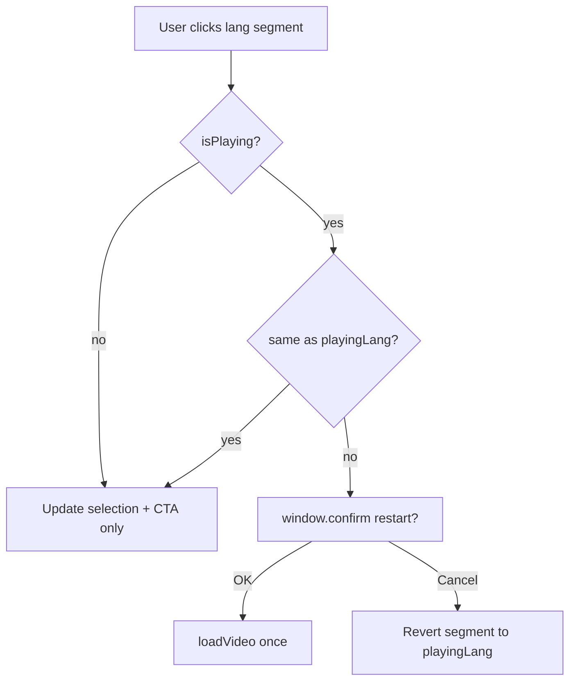

# Change log

## 2026-06-28 — Prevent Wordfence config/lockout state from syncing to staging

**What was built and why:** Created server-side scripts to prevent Wordfence's security state (lockouts, blocklists, enforcement settings, and plugin config) from syncing from production to staging. Staging should get content/DB clones from production but never inherit Wordfence's active security state, which could block legitimate staging access or interfere with testing.

**Files created:**

- `app/public/wp-content/server-scripts/SYNCTOSTAGING.sh` — main sync script that exports production DB (excluding Wordfence tables), imports to staging, rewrites URLs, syncs media files, and triggers post-sync cleanup
- `app/public/wp-content/server-scripts/SYNCTOSTAGING-post.sh` — post-sync script that deactivates Wordfence on staging only (gated by hostname check)
- `app/public/wp-content/server-scripts/staging-deploy-wrapper.sh` — wrapper script called by the staging-deploy SSH key that runs both git pull and the full sync
- `app/public/wp-content/server-scripts/README.md` — deployment instructions and troubleshooting guide

**Files modified:**

- `app/public/wp-content/.gitignore` — added server-scripts/ directory to tracked files
- `app/public/wp-content/CHANGES.md` — this entry

**Patterns or conventions followed from the codebase:**

- Server scripts live outside the git repo on DreamHost (documented in README)
- Used existing table prefix `bbs_wp_` from wp-config.php for Wordfence table exclusions
- Added safety gates (lock file, environment check, SSH key restrictions) following security best practices
- Documented deployment steps clearly since these scripts require manual server setup

**Wordfence tables excluded from sync:**

- `bbs_wp_wfBlockedIPLog` — blocked IP log
- `bbs_wp_wfBlocks` — current block rules
- `bbs_wp_wfCrawlers` — crawler detection data
- `bbs_wp_wfHits` — traffic hits log
- `bbs_wp_wfHoover` — hoover data
- `bbs_wp_wfIssues` — security issues
- `bbs_wp_wfLockedOut` — locked out users
- `bbs_wp_wfLogins` — login attempts log
- `bbs_wp_wfReverseCache` — reverse cache
- `bbs_wp_wfStatus` — plugin status
- `bbs_wp_wfNotifications` — notifications
- `bbs_wp_wfConfig` — plugin settings (including custom blocking rules)

**Safety features:**

- Lock file prevents overlapping sync runs
- Cleanup trap removes temporary SQL files even on failure
- Stale file cleanup removes dump files older than 1 day (cannot delete current run's file due to -mtime +1)
- Post-sync script checks hostname with fail-closed logic (aborts on empty string, error, or non-staging URL)
- Separate SSH key for sync operations prevents privilege escalation (staging-deploy key remains git pull only)
- SSH key restrictions in authorized_keys limit what each key can do
- Table exclusion is secondary safety measure; post-sync deactivation is primary control

**Security improvement (post-review):**

Initial design used a wrapper script to expand the existing staging-deploy SSH key's capabilities, which would have been a privilege escalation risk. Updated approach uses a separate SSH key (`staging-sync-deploy`) with a forced command to run the sync script. This restricts the key to only running the sync script (not arbitrary commands) while still returning the script's exit status to GitHub Actions for proper failure detection. The staging-deploy key remains unchanged (forced command for git pull only). If either key leaks, the blast radius is limited to that specific operation.

**Additional clarifications:**

- The fail-closed environment check in SYNCTOSTAGING-post.sh protects the Wordfence deactivation step specifically, not the DB export/import itself
- The sync script paths are hardcoded server-side, making misconfiguration unlikely
- Deprecated staging-deploy-wrapper.sh should be removed from server if previously uploaded
- The sync key uses a forced command (not unrestricted access) to maintain security boundary while preserving observability

**Security review documentation:**

Added a comprehensive "Security Review" section to `server-scripts/README.md` documenting:
- Problem statement and scope (what the system protects against)
- Concerns and resolutions table
- Reasoning for key design decisions
- Residual risks and accepted tradeoffs (Wordfence table drift, SSH key leakage with accurate acceptance rationale noting staging as destructive target, secret rotation policy)
- GitHub Actions secret exposure surface (documented current configuration: staging-related secrets migrated to environment-level (staging environment) for better defense-in-depth, branch protection rules in place for main (PR required, status checks, force push blocked), important distinction that branch protection protects workflow YAML but not server-side authorized_keys configuration)
- Testing and validation status (design-level review only, pending live validation)
- Scope note (Step 1 staging sync only; Step 2 production WAF bypass tracked separately)

This provides a complete audit trail for future reference and makes the security review legible to someone reading it in a year who wasn't part of these conversations.

**Deployment required:**

These scripts must be manually uploaded to DreamHost at `/home/USER/` and made executable. The GitHub Actions workflow has been updated to trigger the sync script after git pull using the new `DREAMHOST_STAGING_SYNC_SSH_KEY` secret. The deploy-staging job now uses the `staging` environment to access environment-level secrets. See `server-scripts/README.md` for full deployment instructions.

**Verification:** After deployment, manually run `/home/USER/SYNCTOSTAGING.sh` via SSH and verify:
- Wordfence tables are excluded from the export
- Database imports successfully to staging
- Wordfence is deactivated on staging after sync completes

**What the next logical step would be:** Deploy the scripts to DreamHost following the instructions in `server-scripts/README.md`, then create a separate SSH key for sync operations and add it to the GitHub staging environment as `DREAMHOST_STAGING_SYNC_SSH_KEY`. The staging-deploy key remains unchanged (git pull only).

## 2026-06-25 — Document production-targeting tests in testing.md

**What was built and why:** Added documentation to testing.md explaining which tests intentionally target production and why. This helps future developers understand the security and infrastructure validation rationale.

**Files modified:**

- `app/public/wp-content/testing.md` — added "Tests that target production" section with table and explanations for security and HTTPS/host tests
- `app/public/wp-content/CHANGES.md` — this entry

**Patterns or conventions followed from the codebase:**

- Documented test behavior and rationale in testing.md for team-wide understanding
- Explained why certain tests need production-specific validation
- Provided guidance for future developers adding new production-targeting tests

**Tests documented:**

- **Security hygiene** (`security.spec.js`) - Validates server-level security posture (bot-blocking, IP bans, .htaccess rules) which may differ between environments
- **HTTPS and canonical host** (`https-host.spec.js`) - Validates DNS and hosting infrastructure (HTTP→HTTPS redirects, non-www→www redirects) which are production-specific

**Verification:** Review the new "Tests that target production" section in testing.md for clarity and completeness.

## 2026-06-25 — Fix fallback URLs to use staging instead of production

**What was built and why:** Fixed hardcoded production URLs in test fallbacks to use staging. This ensures tests default to staging environment when baseURL is not configured, preventing accidental production hits during local development.

**Files modified:**

- `app/public/wp-content/tests/a11y/axe.spec.js` — changed fallback from `https://www.bebitesmart.org` to `https://staging.bebitesmart.org`
- `app/public/wp-content/tests/smoke/seo.spec.js` — changed fallback from `https://www.bebitesmart.org` to `https://staging.bebitesmart.org`
- `app/public/wp-content/CHANGES.md` — this entry

**Files intentionally unchanged (production URLs are correct):**

- `tests/analytics/helpers/plausible.js` — language switcher fixture intentionally uses production URL
- `tests/helpers/host.js` — CANONICAL_ORIGIN intentionally tests production redirect behavior
- `tests/smoke/https-host.spec.js` — intentionally validates production HTTPS redirects

**Patterns or conventions followed from the codebase:**

- Tests should default to staging environment (BASE_URL in CI is `https://staging.bebitesmart.org`)
- Production-only tests (host redirects) are explicitly marked and skipped on non-production URLs
- Fallback URLs provide safe defaults for local development

**Verification:** Run `pnpm exec playwright test tests/a11y/axe.spec.js tests/smoke/seo.spec.js` to verify tests use staging URLs.

## 2026-06-25 — Security test: add retry logic for transient network failures

**What was built and why:** Enhanced security smoke test to handle transient network failures more robustly. Added Playwright's built-in retry mechanism at the suite level to automatically retry connection failures before treating them as passing. This distinguishes between transient drops (retryable) and consistently unreachable paths (real security issue).

**Files modified:**

- `app/public/wp-content/tests/smoke/security.spec.js` — added `retries: 2` to test.describe.configure() and improved error messages with path context
- `app/public/wp-content/CHANGES.md` — this entry

**Patterns or conventions followed from the codebase:**

- Used Playwright's built-in retry mechanism rather than hand-rolling per-test retry logic
- Suite-level retries handle transient connection drops automatically
- Network errors still treated as passing (path is inaccessible from security perspective)
- Improved error messages include path and clearer context for debugging

**Behavior:**

- Transient connection failures: automatically retried up to 2 times before passing
- Consistently unreachable paths: still surface as repeated failures worth investigating
- Network errors after retries: treated as passing (path is inaccessible)
- Error messages now include path and context for easier debugging

**Verification:** Run `pnpm exec playwright test tests/smoke/security.spec.js` to verify security tests pass with retry logic.

## 2026-06-25 — Plausible event interception: videos/loading.spec.js

**What was built and why:** Added Plausible event interception to video loading tests to prevent sending analytics events to the actual Plausible service during test runs. This ensures tests don't pollute production analytics data.

**Files modified:**

- `app/public/wp-content/tests/videos/loading.spec.js` — added `spyOnPlausible` import and calls before each video play button click (documentary and episode videos)
- `app/public/wp-content/CHANGES.md` — this entry

**Patterns or conventions followed from the codebase:**

- Reused existing `spyOnPlausible` helper from analytics tests
- Added interception before each click that triggers an event (same pattern as analytics/events.spec.js)
- No changes to test logic or assertions - only added event interception

**Tests affected:**

- Documentary video watch button tests (Home and Education pages)
- Documentary thumbnail play button tests (Home and Education pages)  
- Episode video Watch Now tests (all languages)
- Episode thumbnail click test

**Verification:** Run `pnpm exec playwright test tests/videos/loading.spec.js` to verify video loading tests pass with Plausible interception.

**Note:** The analytics/events.spec.js test suite already uses Plausible interception extensively as it's designed to test Plausible event behavior. All other smoke tests (downloads, links, blocks, etc.) are read-only and don't trigger Plausible events.

## 2026-06-25 — PDF Toggle Playwright tests: critical pages with validation

**What was built and why:** Added comprehensive Playwright tests for the pdf-toggle block that check all critical pages for pdf-toggle elements, validate view PDF buttons and download links, and verify click functionality (iframe visibility and src loading).

**Files created or modified:**

- `app/public/wp-content/tests/smoke/pdf-toggle.spec.js` — new test suite using CRITICAL_PAGES, pdf-toggle detection, view button validation (checks iframe data-src URLs, clicks to verify visibility and src loading), download link validation (checks href URLs), and edge case handling for pdf-toggle blocks without valid elements
- `app/public/wp-content/CHANGES.md` — this entry

**Patterns or conventions followed from the codebase:**

- Reused `gotoExpectOk()` helper from existing smoke tests
- Used CRITICAL_PAGES from paths.js (same as other smoke tests like blocks, links, seo)
- Followed existing test structure with `test.describe()`, parameterized tests, and JSON test attachments
- Used data-testid selectors matching the component's implementation (pdf-btn-en-{blockId}, pdf-btn-es-{blockId}, pdf-viewer-en-{blockId}, pdf-viewer-es-{blockId})
- Skipped tests when no pdf-toggle is found (similar to download auto-scan behavior)

**Behavior:**

- Tests all CRITICAL_PAGES (11 pages: Home, Learn, Evidence, News & media, Partnerships, Contact, Donate, Parents, Legal, Advisors, Team)
- For each page, checks if `.pdf-toggle-block` elements exist
- If no pdf-toggle found, skips the test for that page
- If pdf-toggle found, validates:
  - View PDF buttons have valid iframe URLs (via data-src attribute)
  - Clicks view PDF buttons to verify they work (checks iframe visibility and src attribute)
  - Intercepts Plausible analytics events using spyOnPlausible() to prevent sending to actual service
  - Download links have valid URLs (via href attribute)
- Edge case: fails if pdf-toggle exists but has no valid view buttons OR download links
- Attaches detailed JSON results for debugging (includes intercepted Plausible events)

**Verification:** Run `pnpm exec playwright test tests/smoke/pdf-toggle.spec.js` to test all critical pages.

**What the next logical step would be:** Monitor test results in CI to ensure pdf-toggle blocks across the site have valid URLs. Add new pages to CRITICAL_PAGES if they contain pdf-toggle blocks.

## 2026-06-22 — TESTING.md: document ruleset bypass for production-first fixes

**What was built and why:** Documented the chicken-and-egg case where CI tests production but the fix is only in the PR—repo admins can bypass `main` rulesets, merge, deploy, then re-run Playwright.

**Files modified:**

- `app/public/wp-content/testing.md` — new “Merging when production must be updated first” under “When tests run”
- `app/public/wp-content/CHANGES.md` — this entry

## 2026-06-22 — Bio affiliation: darker color + theme override (production still on #6b7280)

**What was built and why:** CI still fails `.bio-affiliation` color-contrast because **production HTML inlines old plugin CSS** (`color:#6b7280`). Repo fix was never deployed. Darkened to `#374151` (~10:1) with `!important` in plugin CSS, and added the same rule to child theme `shared-block-styles.css` so a theme deploy fixes live site even if inlined block CSS is stale.

**Files modified:**

- `plugins/custom-blocks-for-be-bite-smart/src/bio-card/style.css`
- `plugins/custom-blocks-for-be-bite-smart/build/bio-card/style-index.css`
- `plugins/custom-blocks-for-be-bite-smart/build/bio-card/style-index-rtl.css`
- `themes/twentytwentyfive-child/css/shared-block-styles.css`
- `themes/twentytwentyfive-child/build/shared-blocks.css`
- `themes/twentytwentyfive-child/build/shared-blocks-rtl.css`
- `app/public/wp-content/CHANGES.md` — this entry

**Deploy:** `git pull` on DreamHost for `wp-content`, then **WP Super Cache → Delete Cache**. Theme override should pass a11y immediately; plugin deploy updates inlined CSS long-term.

## 2026-06-22 — Bio affiliation contrast: darken gray for stable axe pass

**What was built and why:** Advisors a11y failed in CI on `.bio-affiliation` with `#737a87` (4.31:1) while DevTools showed `#6b7280`. Not a cache issue — `#6b7280` is only ~4.8:1 on white (borderline), and axe/CI sometimes resolves slightly lighter theme grays when the cascade differs. Darkened affiliation to `#4b5563` (~7.5:1) with `html body` specificity so plugin color wins over theme presets.

**Files modified:**

- `plugins/custom-blocks-for-be-bite-smart/src/bio-card/style.css`
- `plugins/custom-blocks-for-be-bite-smart/build/bio-card/style-index.css` (rebuilt)
- `plugins/custom-blocks-for-be-bite-smart/build/bio-card/style-index-rtl.css` (rebuilt)
- `app/public/wp-content/CHANGES.md` — this entry

**Deploy:** Build plugin on server and purge WP Super Cache so inlined/global styles pick up the new color.

## 2026-06-22 — Rename testing.md to TESTING.md

**Files modified:**

- `app/public/wp-content/testing.md` → `app/public/wp-content/TESTING.md`
- `app/public/wp-content/README.md` — link updated
- `app/public/wp-content/TESTING.md` — internal path reference
- `app/public/wp-content/CHANGES.md` — this entry

## 2026-06-22 — A11y: wait for bio cards; Advisors block presence (false-pass fix)

**What was built and why:** PR and push runs both hit production, but Advisors a11y passed with 0 violations while a later run failed on `.bio-affiliation` color contrast — likely stale cache or HTML without bio cards at scan time. Added bio-card wait before axe on Advisors/Team and Advisors block-presence check.

**Files modified:**

- `app/public/wp-content/tests/helpers/paths.js` — `A11Y_PAGE_READY_SELECTORS`, Advisors in `BLOCK_PRESENCE_PAGES`
- `app/public/wp-content/tests/helpers/page.js` — `waitForA11yPageReady()`
- `app/public/wp-content/tests/a11y/axe.spec.js` — wait before scan
- `app/public/wp-content/testing.md` — production/cache explanation, test counts (110)
- `app/public/wp-content/CHANGES.md` — this entry

## 2026-06-22 — CI: Playwright runs on pull requests only

**What was built and why:** Workflow already targeted PRs only; aligned docs and fixed YAML indentation. Avoids duplicate runs on merge (`push` + `pull_request` closed) now that PRs are required before `main`.

**Files modified:**

- `app/public/wp-content/.github/workflows/playwright.yml` — `pull_request` to `main` only (no `push`)
- `app/public/wp-content/testing.md` — when tests run
- `app/public/wp-content/README.md` — GitHub Actions note
- `app/public/wp-content/CHANGES.md` — this entry

## 2026-06-22 — testing.md: add test counts (109 total)

**What was built and why:** Added per-group and per-suite test counts to `testing.md` so readers can see suite size at a glance.

**Files modified:**

- `app/public/wp-content/testing.md` — Test count section, overview table column, section headers
- `app/public/wp-content/CHANGES.md` — this entry

## 2026-06-22 — Broken links: scan all critical pages

**What was built and why:** Expanded internal link checks from Home, Learn, and Evidence to all 11 `CRITICAL_PAGES` so broken same-origin links are caught on any main route.

**Files modified:**

- `app/public/wp-content/tests/helpers/paths.js` — `LINK_CHECK_PAGES` derived from `CRITICAL_PAGES` with `LINK_CHECK_MAX_LINKS` (50)
- `app/public/wp-content/testing.md` — updated broken links coverage
- `app/public/wp-content/CHANGES.md` — this entry

**Verification:** `pnpm exec playwright test tests/smoke/links.spec.js` — 10/11 pass on production. **Parents** fails: link to `https://www.bebitesmart.org/education` (404) — update to `/learn/` in WordPress.

## 2026-06-22 — testing.md: plain-language guide to automated tests

**What was built and why:** Added `testing.md` so non-technical team members can understand what Playwright tests cover, when they run, and how to read GitHub results—without reading spec files. Technical appendix included for developers.

**Files created or modified:**

- `app/public/wp-content/testing.md` — new guide (overview table, per-suite explanations, known failures, technical appendix)
- `app/public/wp-content/README.md` — link to `testing.md` from Playwright section
- `app/public/wp-content/CHANGES.md` — this entry

## 2026-06-22 — Expand security hygiene smoke tests

**What was built and why:** Extended the security oops detector beyond wp-config, `.env`, and `debug.log` to cover common WordPress exposure paths (version files, XML-RPC, backups, VCS, dependency manifests).

**Files modified:**

- `app/public/wp-content/tests/helpers/security.js` — 12 paths, `SECURITY_RATIONALE` attachments, `wp-config-sample.php`, `xmlrpc.php`, backups, `.git/HEAD`, `composer.json`
- `app/public/wp-content/tests/smoke/security.spec.js` — rationale attachments per check
- `app/public/wp-content/README.md` — expanded security table
- `app/public/wp-content/CHANGES.md` — this entry

**Production results (9/12 pass):**

| Path | Status | Action |
|------|--------|--------|
| `readme.html`, `license.txt` | **200** — fail | Delete from web root or deny in `.htaccess` |
| `xmlrpc.php?rsd` | **200** — fail | Disable XML-RPC or block RSD discovery |
| All other new checks | Pass | — |

**What the next logical step would be:** Harden production (delete/deny `readme.html` + `license.txt`, disable XML-RPC) so CI goes green.

## 2026-06-22 — HTTPS and canonical www host smoke tests

**What was built and why:** Added production host hygiene checks so CI catches broken HTTP→HTTPS upgrades or apex/non-www URLs that stop redirecting to the canonical `https://www.bebitesmart.org` origin.

**Files created or modified:**

- `app/public/wp-content/tests/helpers/host.js` — canonical origin constants, redirect assertions
- `app/public/wp-content/tests/smoke/https-host.spec.js` — 11 tests for host resolution and HTTPS upgrade
- `app/public/wp-content/README.md` — HTTPS/host section and run command
- `app/public/wp-content/CHANGES.md` — this entry

**Behavior:**

- Tests `http://bebitesmart.org`, `http://www.bebitesmart.org`, and `https://bebitesmart.org` for `/` and `/learn/`
- Asserts final URL is `https://www.bebitesmart.org` with HTTP 200
- HTTP entry points must redirect to HTTPS on the first hop
- Skipped when `PLAYWRIGHT_BASE_URL` is not the production canonical origin (staging/local safe)

**Verification:** `pnpm exec playwright test tests/smoke/https-host.spec.js` — 11/11 pass on production.

## 2026-06-22 — Download tests: auto-scan critical pages for download links

**What was built and why:** Switched download smoke tests from a per-page allowlist with `minCount` floors to an auto-scan across all `CRITICAL_PAGES`. New PDF-toggle blocks on any critical page are verified automatically without updating test config.

**Files modified:**

- `app/public/wp-content/tests/helpers/paths.js` — replaced `DOWNLOAD_FILE_PAGES` with `DOWNLOAD_SCAN_CHECKS` (derived from `DOWNLOAD_CHECKS`)
- `app/public/wp-content/tests/smoke/downloads.spec.js` — loops `CRITICAL_PAGES`, skips pages with no download links, verifies every match
- `app/public/wp-content/README.md` — documents auto-scan behavior
- `app/public/wp-content/CHANGES.md` — this entry

**Behavior:**

- Scans each critical page for PDF-toggle, episode video, and coloring-book download selectors
- Pages with no matching links are skipped (7 skipped on production today)
- Every link found must return HTTP 200 with the expected file `content-type`

**Verification:** `pnpm exec playwright test tests/smoke/downloads.spec.js` — 4 passed, 7 skipped on production.

**Tradeoff:** Removing a download link no longer fails CI unless a page ends up with zero downloads entirely. Catches broken URLs for anything still linked on the page.

## 2026-06-22 — Expand download URL smoke tests to News & media and Parents

**What was built and why:** Extended the download smoke suite to cover every production page with PDF-toggle or download-card file links, including Learn article PDFs that were previously missed.

**Files modified:**

- `app/public/wp-content/tests/helpers/paths.js` — shared `DOWNLOAD_CHECKS` helpers; added News & media and Parents; Learn now includes PDF-toggle article PDFs
- `app/public/wp-content/README.md` — updated download coverage table
- `app/public/wp-content/CHANGES.md` — this entry

**Coverage (production-backed):**

| Page | Downloads verified |
|------|-------------------|
| Learn | 2 PDF-toggle PDFs, 4 episode MP4s, 2 coloring-book PDFs |
| News & media | 3 PDF-toggle PDFs |
| Partnerships | 1 PDF-toggle PDF |
| Parents | 2 PDF-toggle PDFs (EN/ES parent guide) |

**Verification:** `pnpm exec playwright test tests/smoke/downloads.spec.js` passes on production (`4/4`).

**What the next logical step would be:** Add educational-content download coverage when `#download-educational-content` has live links on production.

## 2026-06-22 — Download URL smoke tests for PDFs and media files

**What was built and why:** Added read-only smoke checks that verify key download links on production return real files, so CI catches broken upload URLs, wrong file types, or missing downloadable assets even when the page itself still renders.

**Files created or modified:**

- `app/public/wp-content/tests/helpers/downloads.js` — shared helpers to collect download links and verify file-like HTTP responses
- `app/public/wp-content/tests/smoke/downloads.spec.js` — checks Learn and Partnerships download URLs
- `app/public/wp-content/tests/helpers/paths.js` — `DOWNLOAD_FILE_PAGES` config
- `app/public/wp-content/README.md` — download test command and behavior notes
- `app/public/wp-content/CHANGES.md` — this entry

**Patterns or conventions followed from the codebase:**

- Reused `gotoExpectOk()` and JSON test attachments like the other smoke suites
- Kept page coverage config-driven in `paths.js`, similar to SEO, blocks, and links
- Extended existing download-card / PDF-toggle selectors already used by analytics tests instead of inventing new ones

**Problems encountered and how they were fixed:**

- Learn currently has no live links in `#download-educational-content`, so the suite targets the download sections that actually render on production today: episode videos, coloring-book PDFs, and Partnerships PDF downloads
- Some download URLs are off-origin (`bbs-downloads.janet-spellman.workers.dev`), so the helper preserves absolute URLs for cross-origin requests instead of forcing same-origin paths

**Verification:** `pnpm exec playwright test tests/smoke/downloads.spec.js` passes on production (`2/2`). Verified file responses include `application/pdf` for PDFs and `video/mp4` for episode downloads.

**TODOs:** Add educational-content PDF download coverage when that section has live production links to validate.

**What the next logical step would be:** Expand file checks to additional downloadable assets if more PDF-toggle or download-card sections are added to other key pages.

## 2026-06-22 — SEO smoke tests (title, canonical, meta, robots, sitemap)

**What was built and why:** Added read-only SEO checks on all critical pages plus `/robots.txt` and XML sitemap so CI catches missing titles, canonicals, meta descriptions, or broken crawl files.

**Files created or modified:**

- `app/public/wp-content/tests/helpers/seo.js` — `assertPageSeo`, `assertRobotsTxt`, `assertSitemap`, canonical URL helper
- `app/public/wp-content/tests/smoke/seo.spec.js` — 11 page tests + robots.txt + sitemap
- `app/public/wp-content/tests/helpers/paths.js` — `SEO_CHECK_PAGES` (= `CRITICAL_PAGES`)
- `app/public/wp-content/README.md` — SEO essentials table and run command
- `app/public/wp-content/CHANGES.md` — this entry

**Patterns or conventions followed from the codebase:**

- Reused `gotoExpectOk()` and JSON test attachments (same as block-presence / security specs)
- `request.get` for robots.txt and sitemap (no browser needed)
- All in One SEO: `/sitemap.xml` primary; fallbacks `/sitemap_index.xml`, `/wp-sitemap.xml`

**Verification:** 12/13 pass against production. **Advisors** (`/advisors/`) fails: no `<meta name="description">` — add one in WordPress (All in One SEO) to clear.

**TODOs:** Add `Sitemap:` line to robots.txt in AIOSEO (optional; sitemap is checked separately).

**What the next logical step would be:** Fix Advisors meta description in WP admin, or expand security hygiene (`xmlrpc.php`, `readme.html`).

## 2026-06-21 — Block presence smoke: Contact, Donate, Team

**What was built and why:** Extended block-presence checks to Contact, Donate, and Team so CI catches missing forms, donate CTA, or team bio cards even when pages still return 200.

**Files modified:**

- `app/public/wp-content/tests/helpers/paths.js` — added Contact, Donate, Team to `BLOCK_PRESENCE_PAGES`
- `app/public/wp-content/CHANGES.md` — this entry

**Selectors (production-backed):**

| Page | Check |
|------|--------|
| Contact | `form.forminator-custom-form` |
| Donate | `a[href*="paypal.com/donate"]` |
| Team | `article.wp-block-custom-bio-card` (min 3) |

**Verification:** 5/5 block-presence tests pass against production.

## 2026-06-21 — Smoke tests for block presence on Learn and Evidence

**What was built and why:** Added a focused smoke suite to catch editor/content regressions where key page-specific blocks disappear even though the page still returns 200 and has the core layout.

**Files created or modified:**

- `app/public/wp-content/tests/smoke/blocks.spec.js` — page-specific content block presence checks
- `app/public/wp-content/tests/helpers/paths.js` — `BLOCK_PRESENCE_PAGES` config for Learn and Evidence
- `app/public/wp-content/CHANGES.md` — this entry

**Patterns or conventions followed from the codebase:**

- Reused `gotoExpectOk()` from existing smoke/video tests
- Kept selectors production-backed and lightweight, similar to `CRITICAL_PAGES` / `LINK_CHECK_PAGES`
- Used JSON test attachments for debugging, same style as other Playwright specs

**Problems encountered and how they were fixed:**

- Initial Evidence selector used `.pdf-toggle-block`, which appears in fetched HTML but not the rendered DOM on production. Updated the test to use the live block marker `article.wp-block-custom-research-article`.

**TODOs:** Expand block-presence checks to remaining critical pages (e.g. Parents, Advisors, Partnerships) when stable selectors are identified.

**What the next logical step would be:** Add SEO / crawl smoke (`robots.txt`, canonical, meta description) or expand security hygiene paths (`xmlrpc.php`, `readme.html`).

## 2026-06-21 — Document wp-config 500 as acceptable in security test

**What was built and why:** Clarified that `/wp-config.php` fails the security test only on **2xx**. **500** is acceptable on shared hosts (DreamHost PHP abort); requiring **403** would need wp-config above the web root — unnecessary for this oops detector.

**Files modified:**

- `app/public/wp-content/tests/helpers/security.js` — rationale comments + `WP_CONFIG_RATIONALE`
- `app/public/wp-content/tests/smoke/security.spec.js` — test title + HTML report attachment
- `app/public/wp-content/README.md` — security table and deploy section
- `app/public/wp-content/server-snippets/root-htaccess-wp-config.snippet` — optional only, not required
- `app/public/wp-content/CHANGES.md` — this entry

## 2026-06-21 — wp-config security test + RedirectMatch snippet for DreamHost

**What was built and why:** `<Files>` and `RewriteRule` for wp-config often return **500** on DreamHost (PHP runs before deny). Updated snippet to `RedirectMatch 403` at top of `.htaccess`; security test now fails wp-config only on **2xx** (file served), not on 500.

**Files modified:**

- `app/public/wp-content/server-snippets/root-htaccess-wp-config.snippet` — `RedirectMatch` first line
- `app/public/wp-content/tests/helpers/security.js` — per-path modes (`blocked` vs `not-public`)
- `app/public/wp-content/tests/smoke/security.spec.js` — updated expectations
- `app/public/wp-content/README.md` — DreamHost htaccess guidance
- `app/public/.htaccess` — LocalWP uses RedirectMatch
- `app/public/wp-content/CHANGES.md` — this entry

## 2026-06-17 — Remove wp-content .htaccess debug.log block

**What was built and why:** Removed `wp-content/.htaccess` that denied web access to `debug.log`. Blocking via repo conflicted with occasionally enabling `WP_DEBUG_LOG`; production should keep debug off by default instead. Security test still fails if `debug.log` is publicly readable (HTTP 200).

**Files deleted:**

- `app/public/wp-content/.htaccess`

**Files modified:**

- `app/public/wp-content/README.md` — debugging vs security test note
- `app/public/wp-content/CHANGES.md` — this entry

## 2026-06-17 — Apache 403 rules for wp-config.php and debug.log

**What was built and why:** Return **403** for `/wp-config.php` (instead of 500). Site-root snippet for DreamHost; ~~wp-content/.htaccess for debug.log~~ (removed — see entry above).

**Files created or modified:**

- `app/public/wp-content/server-snippets/root-htaccess-wp-config.snippet` — paste into **site root** `.htaccess` on DreamHost (manual; not deployed by git pull)
- `app/public/wp-content/README.md` — DreamHost one-time setup steps
- `app/public/wp-content/CHANGES.md` — this entry

**Deploy:** Copy snippet into site root `.htaccess` on DreamHost once, then re-run `tests/smoke/security.spec.js`.

## 2026-06-17 — Security hygiene smoke tests

**What was built and why:** Lightweight read-only checks that sensitive paths are not publicly readable (403/404 oops detector).

**Files created:**

- `app/public/wp-content/tests/helpers/security.js` — `SENSITIVE_PATHS`, `isSensitivePathBlocked()`
- `app/public/wp-content/tests/smoke/security.spec.js` — 3 parameterized GET checks

**Files modified:**

- `app/public/wp-content/README.md` — security test command and scope
- `app/public/wp-content/CHANGES.md` — this entry

**Production snapshot (2026-06-17):**

- `/.env` — 404 (pass)
- `/wp-config.php` — 500 (fails strict test; not 200 but host should ideally return 403)
- `/wp-content/debug.log` — **200 (fails — file is publicly readable; remove or block on server)**

**TODOs:** With debug disabled and log deleted, `/wp-content/debug.log` should 404. If enabling debug temporarily, expect the security test to fail until logging is off and the file is removed or not web-accessible.

## 2026-06-17 — Fix a11y: bio-card headings and aside landmark labels

**What was built and why:** Resolved three axe failures after adding `best-practice` rules: bio names skipped from h1 to h3 on Team/Advisors; Learn page had two unlabeled `<aside>` landmarks.

**Files modified:**

- `app/public/wp-content/plugins/custom-blocks-for-be-bite-smart/src/bio-card/bio-card.php` — person name `h3` → `h2.bio-name`
- `app/public/wp-content/plugins/custom-blocks-for-be-bite-smart/src/bio-card/style.css` — styles target `.bio-details > h2.bio-name`
- `app/public/wp-content/plugins/custom-blocks-for-be-bite-smart/src/includes/site-lang.php` — `bitesmart_complementary_landmark_labels()` adds `aria-label` from first heading in `core/group` asides
- `app/public/wp-content/plugins/custom-blocks-for-be-bite-smart/build/bio-card/` — rebuilt CSS
- `app/public/wp-content/CHANGES.md` — this entry

**Deploy:** Upload plugin PHP + build, purge WP Super Cache, then re-run `pnpm exec playwright test tests/a11y/axe.spec.js`.

## 2026-06-17 — A11y: add best-practice axe rules

**What was built and why:** Expanded axe scope with the `best-practice` tag so extra nitpicks beyond WCAG A/AA are scanned. Minor findings remain non-blocking in attachments.

**Files modified:**

- `app/public/wp-content/tests/a11y/helpers/axe.js` — `AXE_RULE_TAGS` includes `best-practice`
- `app/public/wp-content/tests/a11y/axe.spec.js` — updated test title
- `app/public/wp-content/README.md` — scope description
- `app/public/wp-content/CHANGES.md` — this entry

**New blocking failures on production (moderate, best-practice):**

- **Learn** — `landmark-unique`: duplicate `<aside>` landmarks without unique labels (`.wpbbe-8` / `.wpbbe-11`)
- **Advisors** — `heading-order`: bio card `h3` after skipped heading level
- **Team** — `heading-order`: same bio card pattern

**TODOs:** Fix landmark labels on Learn and heading levels in bio-card block (or page templates) so CI passes again. Minor-impact violations still 0 across all pages with expanded tags.

## 2026-06-17 — A11y report: always list minor violations (non-blocking)

**What was built and why:** Minor axe findings were already non-blocking but easy to miss (section hidden when empty; JSON said "ignored"). Report now always includes a **Minor violations** section and `minorViolations` in JSON attachments.

**Files modified:**

- `app/public/wp-content/tests/a11y/helpers/axe.js` — explicit minor section; clearer scope labels
- `app/public/wp-content/README.md` — minor issues documented as logged, not blocking
- `app/public/wp-content/CHANGES.md` — this entry

## 2026-06-17 — A11y tests: fail on moderate violations too

**What was built and why:** Raised the axe failure threshold from critical/serious to include **moderate** violations. Minor nits still ignored.

**Files modified:**

- `app/public/wp-content/tests/a11y/helpers/axe.js` — `BLOCKING_IMPACTS` includes `moderate`; renamed helper to `expectNoBlockingA11yViolations`
- `app/public/wp-content/tests/a11y/axe.spec.js` — updated import and test title
- `app/public/wp-content/tests/helpers/paths.js` — comment update
- `app/public/wp-content/README.md` — scope description
- `app/public/wp-content/CHANGES.md` — this entry

**Verification:** 11/11 a11y tests passed against production with moderate threshold.

## 2026-06-17 — A11y tests: attach scan scope and rule list to report

**What was built and why:** Passing a11y tests only showed "ok" with no visibility into which WCAG checks ran. Each test now attaches a plain-text + JSON summary listing rule tags, scope, excludes, every passed rule id, incomplete items, and non-blocking violations.

**Files modified:**

- `app/public/wp-content/tests/a11y/helpers/axe.js` — explicit `withTags(wcag2a/aa, wcag21a/aa)`; `buildA11yScanReport()`
- `app/public/wp-content/tests/a11y/axe.spec.js` — testInfo attachments; clearer test title
- `app/public/wp-content/README.md` — how to read attachments in HTML report
- `app/public/wp-content/CHANGES.md` — this entry

**How to view:** Run tests → `pnpm exec playwright show-report` → open an a11y test → **Attachments** → `{Page} — what was checked`.

## 2026-06-17 — A11y axe scans: all critical pages

**What was built and why:** Expanded axe accessibility tests from 4 pages to all 11 `CRITICAL_PAGES` routes (same list as smoke path tests).

**Files modified:**

- `app/public/wp-content/tests/helpers/paths.js` — `A11Y_CHECK_PAGES = CRITICAL_PAGES`
- `app/public/wp-content/tests/a11y/helpers/axe.js` — exclude YouTube/Vimeo iframes (third-party player markup)
- `app/public/wp-content/README.md` — updated failure description
- `app/public/wp-content/CHANGES.md` — this entry

**Problems encountered and how they were fixed:**

- `/parents/` failed on a **serious** `aria-prohibited-attr` violation inside a YouTube embed (`#movie_player`) — not fixable in our theme. Axe now excludes YouTube/Vimeo iframe subtrees.

**Verification:** 11/11 axe tests passed against production.

## 2026-06-17 — Remove pnpm maturity bypass from custom blocks plugin

**What was built and why:** Removed `pnpm.minimumReleaseAge` and `minimumReleaseAgeExclude` from the custom blocks plugin — same supply-chain policy as the Playwright test package.

**Files modified:**

- `app/public/wp-content/plugins/custom-blocks-for-be-bite-smart/package.json` — removed `pnpm` block
- `app/public/wp-content/.cursor/rules/pnpm-supply-chain.mdc` — scope widened to all wp-content packages
- `app/public/wp-content/README.md` — shared **pnpm install troubleshooting** section; `--frozen-lockfile` in Step 5
- `app/public/wp-content/CHANGES.md` — this entry

**What the next logical step would be:** If `pnpm install` fails in the plugin dir, run `pnpm why <package>` and bump `@wordpress/scripts` (or the blocking transitive dep) rather than re-adding repo bypasses.

## 2026-06-17 — Document pnpm maturity policy (no repo bypasses)

**What was built and why:** Added persistent guidance so `ERR_PNPM_NO_MATURE_MATCHING_VERSION` is troubleshooted instead of disabling pnpm's `minimumReleaseAge` in the repo again.

**Files created or modified:**

- `app/public/wp-content/.cursor/rules/pnpm-supply-chain.mdc` — Cursor rule when editing `package.json` / lockfile
- `app/public/wp-content/README.md` — Playwright install/run/report; maturity error troubleshooting
- `app/public/wp-content/CHANGES.md` — this entry

**What the next logical step would be:** If maturity errors persist after a Playwright bump, run `pnpm why <package>` and align `@playwright/test` + CI Docker image tag with a tree that satisfies your maturity threshold.

## 2026-06-17 — Remove pnpm minimumReleaseAge overrides from test package

**What was built and why:** Removed project-level `pnpm.minimumReleaseAge` and `.npmrc` workarounds from the Playwright test package. Those disabled pnpm’s release-maturity safety; CI installs from the frozen lockfile without them.

**Files modified:**

- `app/public/wp-content/package.json` — removed `pnpm` block
- `app/public/wp-content/.npmrc` — deleted
- `app/public/wp-content/CHANGES.md` — this entry

**Note:** See README → **Playwright Tests** → `ERR_PNPM_NO_MATURE_MATCHING_VERSION` for troubleshooting. Do not re-add repo-level bypasses.

## 2026-06-17 — Phase 2b: axe accessibility on key pages

**What was built and why:** Read-only `@axe-core/playwright` scans on home, learn, evidence, and contact against production. Fails only on **critical** or **serious** axe violations — moderate/minor nits are ignored.

**Files created:**

- `app/public/wp-content/tests/a11y/helpers/axe.js` — `expectNoSeriousA11yViolations()`
- `app/public/wp-content/tests/a11y/axe.spec.js` — 4 parameterized page scans

**Files modified:**

- `app/public/wp-content/tests/helpers/paths.js` — `A11Y_CHECK_PAGES`
- `app/public/wp-content/package.json` — `@axe-core/playwright` 4.11.3
- `app/public/wp-content/pnpm-lock.yaml` — lockfile update
- `app/public/wp-content/CHANGES.md` — this entry

**Patterns followed:** Same `gotoExpectOk` + `PLAYWRIGHT_BASE_URL` as smoke tests; `waitForLoadState('load')` instead of `networkidle` for prod stability.

**Verification:** All 4 a11y tests passed against `https://www.bebitesmart.org` locally.

**Next step:** Tighten to zero violations (include moderate) once backlog is clear, or add `exclude()` for known third-party embed issues if any appear.

## 2026-06-17 — Bio card: media library alt on photo

**What was built and why:** Bio card photos used the person's name as `alt` instead of the Media Library alt field. Now uses `bitesmart_attachment_alt_text()` (`""` when unset).

**Files modified:**

- `app/public/wp-content/plugins/custom-blocks-for-be-bite-smart/src/bio-card/bio-card.php`
- `app/public/wp-content/CHANGES.md` — this entry

**Deploy:** upload PHP change and purge cache. No build required.

## 2026-06-17 — Episode card: media library alt on thumbnail

**What was built and why:** Episode cards statically saved `alt` from the episode title. Thumbnails now use Media Library alt only (`""` when unset). `render_block` replaces alt from `thumbnailId` at runtime so existing blocks update without re-saving.

**Files modified:**

- `app/public/wp-content/plugins/custom-blocks-for-be-bite-smart/src/episode-card/index.js` — `thumbnailAlt` attribute; save/onSelect
- `app/public/wp-content/plugins/custom-blocks-for-be-bite-smart/src/includes/site-lang.php` — `bitesmart_attachment_alt_text()`, episode `render_block` alt fix
- `app/public/wp-content/plugins/custom-blocks-for-be-bite-smart/build/episode-card/` — `pnpm run build`
- `app/public/wp-content/CHANGES.md` — this entry

**Deploy:** upload plugin changes and purge cache.

## 2026-06-17 — Video quote: use media library alt on thumbnail

**What was built and why:** `video-quote.php` passed `alt` as the block title to `wp_get_attachment_image()`, overriding the Media Library alt field. Now uses attachment alt only; empty string when unset (no title fallback).

**Files modified:**

- `app/public/wp-content/plugins/custom-blocks-for-be-bite-smart/src/video-quote/video-quote.php`
- `app/public/wp-content/CHANGES.md` — this entry

**Deploy:** upload PHP change and purge cache. No build required.

## 2026-06-17 — Hero block: use media library alt text

**What was built and why:** Hero background images always rendered `alt=""` even when alt text was set in the Media Library. PHP now reads `_wp_attachment_image_alt` from `bgImageLgId` / `bgImageMdId` / `bgImageSmId` at render time. When alt is present, `aria-hidden` is removed from `<picture>` so screen readers get the description.

**Files modified:**

- `app/public/wp-content/plugins/custom-blocks-for-be-bite-smart/src/hero/hero.php` — `bitesmart_hero_bg_image_alt()`, dynamic `alt` on ``
- `app/public/wp-content/CHANGES.md` — this entry

**Deploy:** upload plugin PHP change and purge cache. No `pnpm build` required.

**Note:** Blocks saved before attachment IDs were stored may need images re-selected in the editor once so `bgImage*Id` attributes exist.

## 2026-06-17 — Phase 2 smoke: broken internal links

**What was built and why:** Crawls same-origin links on home, learn, and evidence (capped per page) and fails on HTTP 404 or 5xx — catches menu/permalink drift like the old `/education` slug issue.

**Files created:**

- `app/public/wp-content/tests/helpers/links.js` — `collectInternalLinks`, `checkLinkStatus`
- `app/public/wp-content/tests/smoke/links.spec.js` — 3 parameterized link checks

**Files modified:**

- `app/public/wp-content/tests/helpers/paths.js` — `LINK_CHECK_PAGES`
- `app/public/wp-content/tests/analytics/helpers/plausible.js` — re-export `LINK_CHECK_PAGES`
- `app/public/wp-content/CHANGES.md` — this entry

**Next step:** Lightweight security URL checks, or staging runs via `PLAYWRIGHT_BASE_URL`.

## 2026-06-17 — Phase 1 smoke tests (paths + REST API)

**What was built and why:** Added production-safe smoke coverage: HTTP 200 + core layout on 11 critical pages, and WordPress REST health for `/wp-json/` plus key page slugs. Centralized route constants so slug changes are updated in one place.

**Files created:**

- `app/public/wp-content/tests/helpers/paths.js` — `CRITICAL_PAGES`, `EDUCATION_PATH`, `EVIDENCE_PATH`, `REST_PAGE_SLUGS`
- `app/public/wp-content/tests/helpers/page.js` — `gotoExpectOk`, `assertCriticalDom`
- `app/public/wp-content/tests/smoke/paths.spec.js` — parameterized page smoke (11 pages)
- `app/public/wp-content/tests/smoke/rest-api.spec.js` — REST API smoke (4 tests)

**Files modified:**

- `app/public/wp-content/tests/analytics/helpers/plausible.js` — re-exports shared helpers (backward compatible)
- `app/public/wp-content/CHANGES.md` — this entry

**Patterns followed:** Same `PLAYWRIGHT_BASE_URL` / `gotoExpectOk` conventions as analytics tests; flexible DOM selectors for Twenty Twenty-Five block theme.

**Next step:** Phase 2 — broken internal links on home/learn/evidence, then `@axe-core/playwright` on key pages.

## 2026-06-17 — Fix four failing Playwright CI tests

**What was built and why:** CI had four failures: episode analytics loop left a video playing before switching language (ES segment never went `active`), `/library` 404 (live slug is `/evidence/`), episode video tests timed out waiting on Vimeo network responses (flaky in CI), and `analytics.php` still used `is_page( 'library' )`.

**Files modified:**

- `app/public/wp-content/tests/analytics/events.spec.js` — reload `/learn/` per episode language; use `EVIDENCE_PATH`
- `app/public/wp-content/tests/analytics/helpers/plausible.js` — `EVIDENCE_PATH`, `langCodeToAnalytics()`
- `app/public/wp-content/tests/videos/helpers/videos.js` — assert iframe `src` + visibility only (no network wait)
- `app/public/wp-content/themes/twentytwentyfive-child/inc/analytics.php` — `is_page( 'evidence' )`
- `app/public/wp-content/playwright.config.js` — `workers: 1` in CI to reduce parallel load on production
- `app/public/wp-content/CHANGES.md` — this entry

**Deploy:** child theme `analytics.php` change + cache purge for evidence-page article tracking.

## 2026-06-17 — CI: Playwright Docker image (skip browser install)

**What was built and why:** CI was stalling on `playwright install --with-deps chromium` (apt + ~170MB Chromium download every run, or on cache miss). The job now runs inside `mcr.microsoft.com/playwright:v1.59.1-noble`, which ships browsers and OS deps pre-installed. `@playwright/test` pinned to `1.59.1` to match the image tag.

**Files modified:**

- `app/public/wp-content/.github/workflows/playwright.yml` — `container.image`; removed browser cache + install steps
- `app/public/wp-content/package.json` — exact Playwright version (no caret)
- `app/public/wp-content/CHANGES.md` — this entry

**When bumping Playwright:** update `package.json`, `pnpm-lock.yaml` (specifier + version), and the Docker image tag together.

## 2026-06-17 — CI: cache Playwright browsers, parallel workers

**What was built and why:** Every GitHub Actions run was downloading ~170MB Chromium plus apt font/system packages via `playwright install --with-deps`. Browsers are now cached keyed on `pnpm-lock.yaml`; install runs only on cache miss. Tests use 2 workers in CI and `dot` reporter for shorter logs.

**Files modified:**

- `app/public/wp-content/.github/workflows/playwright.yml` — `actions/cache` on `~/.cache/ms-playwright`; skip install when cache hits
- `app/public/wp-content/playwright.config.js` — `workers: 2` and `fullyParallel: true` in CI
- `app/public/wp-content/package.json` — `test:ci` uses `dot` reporter instead of `list`
- `app/public/wp-content/CHANGES.md` — this entry

**Note:** First run after a `@playwright/test` version bump still does a full install (cache key changes). Later runs should skip that step.

## 2026-06-17 — Analytics: Learn page slug `education` → `learn`

**What was built and why:** `analytics.php` still gated the Learn page listeners on `is_page( 'education' )` after the page slug changed to `learn`. Episode watches, downloads, coloring-book toggles, and documentary tracking on `/learn/` never ran.

**Files modified:**

- `app/public/wp-content/themes/twentytwentyfive-child/inc/analytics.php` — `is_page( 'learn' )` (matches `custom-blocks-for-be-bite-smart.php`)
- `app/public/wp-content/CHANGES.md` — this entry

**Next step:** Deploy child theme and purge cache; re-run Playwright analytics tests against `/learn/`.

## 2026-06-17 — CI: Playwright HTML report artifact upload

**What was built and why:** GitHub Actions warned `No files were found with the provided path: playwright-report/` because the upload step ran even when no HTML report was produced (e.g. install/test step failed before Playwright finished). CI now uses the project-local Playwright CLI, forces the HTML reporter, sets an explicit `outputFolder`, and only uploads when the report exists.

**Files modified:**

- `app/public/wp-content/playwright.config.js` — explicit `outputFolder: "playwright-report"`; CI adds `github` reporter
- `app/public/wp-content/package.json` — `test:ci` script with `--reporter=html,list`
- `app/public/wp-content/.github/workflows/playwright.yml` — `pnpm exec playwright install`, `pnpm run test:ci`, `cache-dependency-path`, upload guarded with `hashFiles`
- `app/public/wp-content/CHANGES.md` — this entry

**Next step:** Push to `main` and confirm the `playwright-report` artifact appears on the workflow run (even when some tests fail).

## 2026-06-17 — Analytics tests: `/education` → `/learn/`

**What was built and why:** Production returns 404 for `/education`; the Learn page slug is `/learn/`. Analytics specs now use a shared `EDUCATION_PATH` constant so CI passes against the live site.

**Files modified:**

- `app/public/wp-content/tests/analytics/helpers/plausible.js` — export `EDUCATION_PATH = "/learn/"`
- `app/public/wp-content/tests/analytics/events.spec.js` — all education-page navigations use `EDUCATION_PATH`
- `app/public/wp-content/tests/videos/loading.spec.js` — import shared constant (removed local duplicate)
- `app/public/wp-content/CHANGES.md` — this entry

**Next step:** Run `pnpm playwright test` from `app/public/wp-content` to confirm the full suite.

## 2026-06-17 — Playwright video loading tests

**What was built and why:** Added Playwright tests that verify Vimeo embeds actually load (not just analytics events): correct iframe `src`, thumbnail hidden, and a successful `player.vimeo.com` network response.

**Files created or modified:**

- `app/public/wp-content/tests/videos/helpers/videos.js` — shared helpers (`expectedVimeoPlayerSrc`, `assertVimeoPlayerLoads`, episode `data-videos` parsing)
- `app/public/wp-content/tests/videos/loading.spec.js` — documentary (home + learn) and episode video loading specs
- `app/public/wp-content/playwright.config.js` — `testDir` set to `./tests` so analytics and video suites both run
- `app/public/wp-content/CHANGES.md` — this entry

**Patterns or conventions followed from the codebase:**

- Reused `gotoExpectOk` from `tests/analytics/helpers/plausible.js`
- Vimeo URL params mirror `src/video-toggle.js` (`autoplay`, `texttrack` / `audiotrack` for ES/HI)
- Education page path via shared `EDUCATION_PATH` in `plausible.js`

**Problems encountered and how they were fixed:**

- `/education` returns 404 on production — tests use `/learn/` via `EDUCATION_PATH`
- Switching episode language while a video is playing opens the restart modal — episode multi-language test reloads the page per language so each run starts from a clean state

**TODOs:**

- Optional: add a spec for mid-play language switch (confirm modal → new embed loads)

**What the next logical step would be:**

- Run full suite: `pnpm playwright test` from `app/public/wp-content`
- Point `PLAYWRIGHT_BASE_URL` at local/staging when testing unpublished changes

## 2026-05-29 — Editable language-switch dialog (block editor)

**What was built and why:** Editors can change confirm-dialog wording without code. Site-wide copy is stored in WordPress (`bitesmart_lang_restart_dialog`), edited from any Video Episode block sidebar → **Language switch dialog**, and passed to the front end via `bitesmartLangRestartDialog`.

**How to use:** Open a Video Episode block → sidebar → **Language switch dialog** → edit title/message/buttons per dialog language (English / Spanish / Hindi sections). Use `{language}` in message and confirm text for the target language name. Click **Save dialog text**. **Reset to defaults** restores built-in copy.

**Files created or modified:**

- `src/includes/lang-restart-dialog.php` — defaults, option, REST `GET/POST /bitesmart/v1/lang-restart-dialog`
- `src/episode-card/lang-restart-dialog-panel.js` — inspector panel + save
- `src/episode-card/index.js` — wires panel into InspectorControls
- `src/video-lang-restart-modal.js` — reads `window.bitesmartLangRestartDialog`, `{language}` placeholder
- `custom-blocks-for-be-bite-smart.php` — require + localize on `video-toggle`
- `build/*` — `pnpm run build`

## 2026-05-29 — Episode language restart: dialog in playing language

**What was built and why:** Confirm modal copy uses the **language currently playing** (not the segment clicked), so a mistaken tap on another language still shows a prompt they understand—e.g. watching EN and tapping HI shows English: “The video will restart in Hindi.”

**Files modified:** `src/video-lang-restart-modal.js`, `src/video-toggle.js`, `build/video-toggle.js` (`pnpm run build`)

## 2026-05-29 — Episode language restart: accessible modal

**What was built and why:** `window.confirm` for mid-play language switches is hard for screen readers and off-brand. Replaced with a single page-level dialog (`role="dialog"`, `aria-modal`, labelled title/description, focus trap, Escape/backdrop cancel, focus return to the segment).

**Files created or modified:**

- `app/public/wp-content/plugins/custom-blocks-for-be-bite-smart/src/video-lang-restart-modal.js` — `confirmLanguageRestart()` Promise API, EN/ES/HI copy
- `app/public/wp-content/plugins/custom-blocks-for-be-bite-smart/src/video-lang-restart-modal.css` — overlay + panel styles (theme accent buttons)
- `app/public/wp-content/plugins/custom-blocks-for-be-bite-smart/src/video-toggle.js` — uses modal instead of `window.confirm`
- `app/public/wp-content/plugins/custom-blocks-for-be-bite-smart/custom-blocks-for-be-bite-smart.php` — enqueues `build/video-toggle.css` with script
- `app/public/wp-content/plugins/custom-blocks-for-be-bite-smart/build/video-toggle.js` (+ `video-toggle.css`) — `pnpm run build`

**Patterns or conventions followed from the codebase:**

- One shared dialog on `document.body` (same enqueue scope as `video-toggle.js` on education + front page)
- Button styling aligned with `block-toggle-btn` / accent-2

**Verification:**

- Play episode → switch language → Cancel / backdrop / Escape → picker reverts, same video
- Confirm → one reload in new language
- Tab cycles only Cancel / Switch buttons while open

## 2026-05-29 — Third episode language: Hindi (not French)

**What was built and why:** Site language config listed French (`fr`) as the third episode language; the client uses Hindi (`hi`) instead.

**Files created or modified:**

- `app/public/wp-content/plugins/custom-blocks-for-be-bite-smart/src/includes/site-lang.php` — `hi` / Hindi / `hindi` analytics
- `app/public/wp-content/plugins/custom-blocks-for-be-bite-smart/src/shared/languages.js` — default languages list
- `app/public/wp-content/plugins/custom-blocks-for-be-bite-smart/src/video-toggle.js` — Hindi watch label, confirm copy, Vimeo `hi` track params
- `app/public/wp-content/themes/twentytwentyfive-child/inc/analytics.php` — `hindi` Plausible suffix
- `app/public/wp-content/tests/analytics/helpers/plausible.js` — `hi` / `hindi` mappings
- `app/public/wp-content/tests/analytics/events.spec.js` — segment `hi` → `hindi`
- `app/public/wp-content/plugins/custom-blocks-for-be-bite-smart/build/*` — `pnpm run build`
- `app/public/wp-content/CHANGES.md` — this entry

**TODOs:** If any block `videosByLang` was saved with key `fr`, re-enter URLs under Hindi in the editor.

## 2026-05-29 — Episode language switch: confirm before restart

**What was built and why:** Tapping EN/ES/HI while a video was playing immediately replaced the Vimeo iframe and started a new stream—rapid toggling could trigger multiple reloads. Language changes during playback now require a confirm dialog; cancel restores the active segment to the language currently playing.

### Problem

In `video-toggle.js`, segment clicks previously called `setEpisodeLanguage(lang, true)`. When `isPlaying` was true, that immediately ran `loadVideo()`—destroying the iframe and loading another Vimeo embed (separate ID per language).

Each toggle = full player restart + new stream. Rapid clicking multiplies Vimeo traffic and hurts UX. The load is browser ↔ Vimeo, not WordPress—but it is still wasteful and annoying.

### Chosen UX

**Confirm restart:** While a video is playing, changing the language segment opens a browser confirm: *“Switch to [language]? The video will restart.”* Reload only if the user accepts. Cancel restores the active segment to the language currently playing.

- **Not playing:** Segment click only updates selection + Watch CTA (no iframe).
- **Playing, same language:** No-op (no confirm, no reload).
- **Playing, different language:** Confirm → on OK, one `loadVideo()`; on Cancel, revert picker to `playingLang`.

This blocks button-smashing without disabling the control or hiding that a restart is required.

### Implementation summary

1. **`playingLang`** — set when `loadVideo()` succeeds (episode cards only); separate from selected segment (`currentLang`).
2. **Segment clicks** — never auto-reload while playing; `handleLangSegmentClick()` handles confirm flow.
3. **Confirm copy** (`RESTART_CONFIRM_MESSAGES`) — target language’s message: EN / ES / HI (e.g. “Switch to English? The video will restart.”). Native `window.confirm()` is blocking, so only one dialog at a time.
4. **Documentary** (`video-quote-block`) — unchanged (no language segments on that block).
5. **Analytics** — no change; Plausible still fires on Watch/play with active `.lang-segment`; user must confirm before a mid-play restart.

### Out of scope (later)

- Custom modal instead of `window.confirm` (better a11y/branding).
- Vimeo Player API track switch without iframe teardown (if moving to one multi-track asset).
- Applying language on “next play” without confirm.

### Verification checklist

- Play episode in EN → switch to ES → Cancel → still EN audio, EN segment active.
- Play EN → switch ES → OK → one reload, ES plays.
- Rapid EN/ES/HI clicks while playing → at most one confirm at a time; no iframe storm without confirmations.
- Switch segment before play → no confirm; first play uses selected language.
- Legacy `.toggle-label` markup behaves the same (shared segment handler).

**Files created or modified:**

- `app/public/wp-content/plugins/custom-blocks-for-be-bite-smart/src/video-toggle.js` — `playingLang`, `handleLangSegmentClick()`, `RESTART_CONFIRM_MESSAGES` (en/es/hi); removed auto-reload on segment click
- `app/public/wp-content/plugins/custom-blocks-for-be-bite-smart/build/video-toggle.js` — compiled output (`pnpm run build`)
- `app/public/wp-content/CHANGES.md` — this entry

**Patterns or conventions followed from the codebase:**

- Episode-only behavior; documentary (`video-quote-block`) unchanged
- Native `window.confirm` (blocking, prevents iframe storm without extra UI)

**Problems encountered and how they were fixed:**

- None

**TODOs:**

- Optional: branded modal instead of `window.confirm` for accessibility

**What the next logical step would be:**

- Manually verify on `/education`: play episode → switch language → Cancel keeps EN; OK restarts in chosen language

## 2026-05-29 — Episode videos: 3+ languages (segmented picker)

**What was built and why:** Episode cards were limited to a binary EN/ES toggle and `vimeoUrlEn` / `vimeoUrlEs` attributes. The site is adding a third language; episodes now use a scalable segmented language picker, JSON `data-videos` map, and shared language config (EN, ES, FR).

**Files created or modified:**

- `app/public/wp-content/plugins/custom-blocks-for-be-bite-smart/src/includes/site-lang.php` — `bitesmart_site_languages()`, `bitesmart_normalize_lang_code()`, episode `render_block` injects `data-videos`, `data-watch-labels`, `data-site-lang`; editor localize via `generate_block_asset_handle`
- `app/public/wp-content/plugins/custom-blocks-for-be-bite-smart/src/shared/languages.js` — shared language list and Vimeo/JSON helpers
- `app/public/wp-content/plugins/custom-blocks-for-be-bite-smart/src/episode-card/episode-helpers.js` — migrate legacy attrs, render language picker, save data attributes
- `app/public/wp-content/plugins/custom-blocks-for-be-bite-smart/src/episode-card/index.js` — `videosByLang`, segmented UI, block deprecation from `vimeoUrlEn`/`vimeoUrlEs`
- `app/public/wp-content/plugins/custom-blocks-for-be-bite-smart/src/episode-card/style.css` — `.episode-lang-picker` / `.lang-segment` styles (legacy toggle CSS retained)
- `app/public/wp-content/plugins/custom-blocks-for-be-bite-smart/src/video-toggle.js` — reads `data-videos`, defaults to site language, supports legacy toggle markup
- `app/public/wp-content/plugins/custom-blocks-for-be-bite-smart/build/*` — `pnpm run build`
- `app/public/wp-content/themes/twentytwentyfive-child/inc/analytics.php` — `getLang()` reads `.lang-segment.active`, French analytics suffix
- `app/public/wp-content/tests/analytics/helpers/plausible.js` — episode tests use lang segments; `episodeLangCode`, `french` mapping
- `app/public/wp-content/tests/analytics/events.spec.js` — loops all configured languages per episode
- `app/public/wp-content/CHANGES.md` — this entry

**Patterns or conventions followed from the codebase:**

- Static block + `render_block` runtime data (same as prior `data-site-lang` approach)
- PDF/download blocks still EN/ES-only; episodes use new segmented picker pattern
- Block `deprecated` + `migrate` for editor; `render_block` + JS legacy fallbacks for saved HTML

**Problems encountered and how they were fixed:**

- Binary toggle CSS (`50%` width, `.es` class) cannot scale to N languages — replaced with `--lang-count` / `--lang-index` on `.episode-lang-picker`
- Existing posts keep legacy HTML until re-saved; `video-toggle.js` still supports `.toggle-label` and `data-vimeo-en`/`es` via `resolveVideosForBlock()`

**TODOs:**

- Re-save episode blocks in the editor to output FR segment when French Vimeo URLs are added
- Extend pdf-toggle / download-card to same `bitesmart_site_languages()` list (out of scope for this change)

**What the next logical step would be:**

- Add French Vimeo URLs per episode in the block sidebar, re-save, and verify FR segment + `episodes-watched-french` in Plausible

## 2026-05-29 — AddToAny share UTM tracking (child theme)

**What was built and why:** AddToAny share buttons should send visitors to the current page with consistent UTM parameters (`utm_source=word_of_mouth`, `utm_medium=share`, `utm_campaign=site_share`) so shared links are attributable in analytics.

**Files created or modified:**
- `app/public/wp-content/themes/twentytwentyfive-child/inc/addtoany.php` — sets `a2a_config.linkurl` in `wp_head` (page URL without existing query string + UTMs)
- `app/public/wp-content/themes/twentytwentyfive-child/functions.php` — `require_once` for `addtoany.php`
- `app/public/wp-content/CHANGES.md` — this entry

**Patterns or conventions followed from the codebase:**
- Same `inc/` + `require_once` pattern as `inc/analytics.php`
- `wp_add_inline_script( 'addtoany-core', …, 'before' )` at priority `20` so UTMs run after the plugin’s inline config

**Problems encountered and how they were fixed:**
- `a2a_config.linkurl` in `wp_head` did not apply to X/Twitter shares — the plugin resets `a2a_config.callbacks` in its own inline script and direct service buttons use the click-time URL. Fixed by hooking `addtoany-core` at enqueue priority `20` and using AddToAny’s `share` callback to set `data.url` with UTMs on every share
- `data-a2a-url` in page HTML stays as the plain permalink until JS runs — expected; `ready` callback now syncs `.a2a_kit[data-a2a-url]` after AddToAny loads (inspector should show UTMs after load, not only on click)

**TODOs:**
- None

**What the next logical step would be:**
- Share a page via AddToAny, open the shared link, and confirm UTMs appear in the landing URL and in Plausible/analytics

## 2026-05-29 — Episode card language toggle defaults to Spanish (TranslatePress)

**What was built and why:** Episode cards are static blocks saved with the EN toggle active and “Watch Now”. When TranslatePress serves the site in Spanish, each card should start on ES (slider position, active label, “Ver Ahora”, and `data-vimeo-es` when play is clicked) without re-saving blocks in the editor.

**Files created or modified:**

- `app/public/wp-content/plugins/custom-blocks-for-be-bite-smart/src/includes/site-lang.php` — shared `bitesmart_site_lang_code()`; `render_block` filter adds `data-site-lang` on `custom/episode-card` output
- `app/public/wp-content/plugins/custom-blocks-for-be-bite-smart/custom-blocks-for-be-bite-smart.php` — loads `site-lang.php` at plugin bootstrap
- `app/public/wp-content/plugins/custom-blocks-for-be-bite-smart/src/video-quote/video-quote.php` — uses shared `bitesmart_site_lang_code()` instead of a duplicate helper
- `app/public/wp-content/plugins/custom-blocks-for-be-bite-smart/src/video-toggle.js` — `setEpisodeLanguage()` applies ES UI on load when `data-site-lang` or document is Spanish; click handler refactored to same helper
- `app/public/wp-content/plugins/custom-blocks-for-be-bite-smart/build/video-toggle.js` — compiled output (`pnpm run build`)
- `app/public/wp-content/plugins/custom-blocks-for-be-bite-smart/src/episode-card/index.js` — comment documenting editor save vs front-end default
- `app/public/wp-content/CHANGES.md` — this entry

**Patterns or conventions followed from the codebase:**

- Same TranslatePress → `en`|`es` detection as video-quote (`trp_get_current_language`, `$TRP_LANGUAGE`, `trp_user_language`, JS fallbacks on `html[lang]` and `body.translatepress-es_`*)
- Static block + runtime fix via shared `video-toggle.js` (episode-card HTML in post content is not re-saved per language)
- `render_block` injection for server-rendered `data-site-lang` on episode cards (mirrors video-quote dynamic attribute)

**Problems encountered and how they were fixed:**

- Episode-card `save()` runs in the editor once and stores the same HTML for every visitor (EN toggle active, “Watch Now”). It cannot know which language TranslatePress will use when someone loads the page later.
- The first paint is therefore always that saved English markup (server-rendered HTML). Language for the current request is applied afterward: PHP `render_block` adds `data-site-lang` when TRP is serving Spanish, then `video-toggle.js` on `DOMContentLoaded` reads that (or `html[lang]` / body class) and updates the toggle UI and play target to ES. We did not change `save()` in the editor, because that would only bake in one default at publish time—not per visitor or per TRP language.
- This targets visitors **on the Spanish version of the site** (e.g. `/es/…`).

**TODOs:**

- Brief flash of EN-active toggle possible before JS runs (skipped — would need PHP to rewrite toggle classes in `render_block` or inline script)
- No listener if user switches TRP language without full page reload (skipped — same as video-quote; typical TRP navigation reloads)

**What the next logical step would be:**

- Open Education in Spanish, confirm each episode card shows ES selected and plays `data-vimeo-es` on Watch Now
- Confirm analytics `episodes-watched-spanish` fires when play is clicked (existing `getLang` reads `.toggle-label.active`)

## 2026-05-29 — Video quote Vimeo language defaults (TranslatePress)

**What was built and why:** When the site is viewed in Spanish via TranslatePress, the mini-documentary (`custom/video-quote`) Vimeo player should default to Spanish audio and subtitles on the same video ID. The block uses one Vimeo URL (unlike episode cards with separate EN/ES IDs), so the embed URL now passes Vimeo’s `texttrack=es` and `audiotrack=es` when the site language is Spanish.

**Files created or modified:**

- `app/public/wp-content/plugins/custom-blocks-for-be-bite-smart/src/video-quote/video-quote.php` — added `video_quote_site_lang_code()` (TranslatePress / locale); outputs `data-site-lang` on the block `<article>`
- `app/public/wp-content/plugins/custom-blocks-for-be-bite-smart/src/video-toggle.js` — for `.video-quote-block` only, sets `currentLang` from `data-site-lang` or document fallback; `buildVimeoPlayerSrc()` appends Spanish track params to the iframe URL
- `app/public/wp-content/plugins/custom-blocks-for-be-bite-smart/build/video-toggle.js` — compiled output from `pnpm run build`
- `app/public/wp-content/CHANGES.md` — this entry

**Patterns or conventions followed from the codebase:**

- Dynamic PHP render + shared `video-toggle.js` enqueue (same as existing video-quote / episode-card flow in `custom-blocks-for-be-bite-smart.php`)
- TranslatePress detection aligned with theme analytics: `trp_get_current_language()` when available, plus `html[lang]` and `body.translatepress-es_`* fallbacks in JS
- Vimeo URL params consistent with `src/qr-experience/partials.php` (`texttrack` on embed); extended with `audiotrack` per Vimeo player docs
- Episode cards unchanged: EN/ES still driven by `.toggle-label` and `data-vimeo-en` / `data-vimeo-es`

**Problems encountered and how they were fixed:**

- First build attempt used `npm run build`; project uses pnpm — rebuilt with `pnpm run build` after user correction
- Initial CHANGES.md entry omitted required sections (TODOs, problems, full paths) — corrected in this update

**TODOs:**

- Plausible `documentary-watched` event still has no language variant (skipped — out of scope for this task; analytics.php would need a small follow-up)
- Not verified against live Vimeo assets — Spanish tracks must exist on the hosted video or Vimeo ignores the params

**What the next logical step would be:**

- On a Spanish URL (or after switching to Spanish), open a page with `video-quote`, play the mini-documentary, and confirm Spanish audio/subtitles in the Vimeo player
- If tracks do not appear, confirm in Vimeo Studio that `es` audio and text tracks exist for that video ID
- Optionally add `-spanish` / `-english` to `documentary-watched` in `app/public/wp-content/themes/twentytwentyfive-child/inc/analytics.php` using the same language detection

## 2026-05-26 — Video quote stacked layout

**What was built and why:** The Documentary Video (`video-quote`) block now keeps the video above the quote text on all screen sizes. Previously, at 900px+ the flex row placed video and text side by side.

**Files modified:**

- `plugins/custom-blocks-for-be-bite-smart/src/video-quote/style.css` — removed row/50% split at large breakpoints; video and text columns stay full width; watch button centered at all breakpoints
- `plugins/custom-blocks-for-be-bite-smart/src/video-quote/video-quote.php` — thumbnail `sizes` updated from half-width `420px` to full-width `90vw`
- `plugins/custom-blocks-for-be-bite-smart/build/video-quote/style-index.css` (and RTL) — rebuilt via `npm run build`

**Patterns followed:** Existing BEM-style class names and column flex on `.video-quote-content-wrapper`; PHP markup unchanged (video already precedes text in DOM).

## 2026-06-17 — Sponsor and outlet logo alt from Media Library only

**What was built and why:** Episode sponsor logos and news/press outlet logos now use Media Library alt text only, defaulting to `""` when unset — no fallback to sponsor name or outlet name. Runtime `render_block` filters refresh alt from attachment IDs for saved HTML.

**Files created or modified:**

- `app/public/wp-content/plugins/custom-blocks-for-be-bite-smart/src/includes/site-lang.php` — `bitesmart_replace_img_alt_by_class()`; funded logo handling in `bitesmart_episode_card_render`; new `bitesmart_outlet_logo_alt_render` for news-and-coverage and press-release blocks
- `app/public/wp-content/plugins/custom-blocks-for-be-bite-smart/src/episode-card/index.js` — `fundedByLogoAlt` attribute; save uses media alt only; `aria-hidden` only when alt empty
- `app/public/wp-content/plugins/custom-blocks-for-be-bite-smart/src/news-and-coverage/index.js` — save `alt: attributes.logoAlt || ""`
- `app/public/wp-content/plugins/custom-blocks-for-be-bite-smart/src/press-release/index.js` — save `alt: attributes.logoAlt || ""`
- `app/public/wp-content/plugins/custom-blocks-for-be-bite-smart/build/` — rebuilt via `pnpm run build`
- `app/public/wp-content/CHANGES.md` — this entry

**Patterns or conventions followed from the codebase:**

- Shared `bitesmart_attachment_alt_text()` helper (same as hero, bio-card, video-quote, episode thumbnail)
- `render_block` filter for legacy saved markup (episode thumbnail pattern extended to sponsor logo and outlet logos)

**Problems encountered and how they were fixed:**

- Partial patch from prior session left PHP outlet filter unapplied — completed `site-lang.php` updates in this session

**TODOs:**

- Existing posts keep saved alt until re-saved; `render_block` overrides at runtime when `logoId` / `fundedByLogoId` are present in block attrs

**What the next logical step would be:**

- Spot-check an episode with a sponsor logo and a news item with an outlet logo: confirm empty alt when Media Library alt is blank, and correct alt when set
