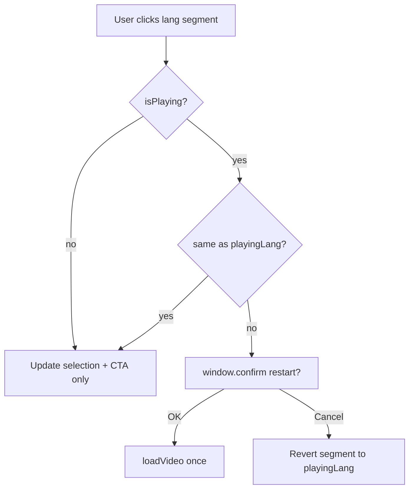

# Change log

# Change log

# Change log

## 2026-06-17 — Fix a11y: bio-card headings and aside landmark labels

**What was built and why:** Resolved three axe failures after adding `best-practice` rules: bio names skipped from h1 to h3 on Team/Advisors; Learn page had two unlabeled `<aside>` landmarks.

**Files modified:**

- `app/public/wp-content/plugins/custom-blocks-for-be-bite-smart/src/bio-card/bio-card.php` — person name `h3` → `h2.bio-name`
- `app/public/wp-content/plugins/custom-blocks-for-be-bite-smart/src/bio-card/style.css` — styles target `.bio-details > h2.bio-name`
- `app/public/wp-content/plugins/custom-blocks-for-be-bite-smart/src/includes/site-lang.php` — `bitesmart_complementary_landmark_labels()` adds `aria-label` from first heading in `core/group` asides
- `app/public/wp-content/plugins/custom-blocks-for-be-bite-smart/build/bio-card/` — rebuilt CSS
- `app/public/wp-content/CHANGES.md` — this entry

**Deploy:** Upload plugin PHP + build, purge WP Super Cache, then re-run `pnpm exec playwright test tests/a11y/axe.spec.js`.

## 2026-06-17 — A11y: add best-practice axe rules

**What was built and why:** Expanded axe scope with the `best-practice` tag so extra nitpicks beyond WCAG A/AA are scanned. Minor findings remain non-blocking in attachments.

**Files modified:**

- `app/public/wp-content/tests/a11y/helpers/axe.js` — `AXE_RULE_TAGS` includes `best-practice`
- `app/public/wp-content/tests/a11y/axe.spec.js` — updated test title
- `app/public/wp-content/README.md` — scope description
- `app/public/wp-content/CHANGES.md` — this entry

**New blocking failures on production (moderate, best-practice):**

- **Learn** — `landmark-unique`: duplicate `<aside>` landmarks without unique labels (`.wpbbe-8` / `.wpbbe-11`)
- **Advisors** — `heading-order`: bio card `h3` after skipped heading level
- **Team** — `heading-order`: same bio card pattern

**TODOs:** Fix landmark labels on Learn and heading levels in bio-card block (or page templates) so CI passes again. Minor-impact violations still 0 across all pages with expanded tags.

## 2026-06-17 — A11y report: always list minor violations (non-blocking)

**What was built and why:** Minor axe findings were already non-blocking but easy to miss (section hidden when empty; JSON said "ignored"). Report now always includes a **Minor violations** section and `minorViolations` in JSON attachments.

**Files modified:**

- `app/public/wp-content/tests/a11y/helpers/axe.js` — explicit minor section; clearer scope labels
- `app/public/wp-content/README.md` — minor issues documented as logged, not blocking
- `app/public/wp-content/CHANGES.md` — this entry

## 2026-06-17 — A11y tests: fail on moderate violations too

**What was built and why:** Raised the axe failure threshold from critical/serious to include **moderate** violations. Minor nits still ignored.

**Files modified:**

- `app/public/wp-content/tests/a11y/helpers/axe.js` — `BLOCKING_IMPACTS` includes `moderate`; renamed helper to `expectNoBlockingA11yViolations`
- `app/public/wp-content/tests/a11y/axe.spec.js` — updated import and test title
- `app/public/wp-content/tests/helpers/paths.js` — comment update
- `app/public/wp-content/README.md` — scope description
- `app/public/wp-content/CHANGES.md` — this entry

**Verification:** 11/11 a11y tests passed against production with moderate threshold.

## 2026-06-17 — A11y tests: attach scan scope and rule list to report

**What was built and why:** Passing a11y tests only showed "ok" with no visibility into which WCAG checks ran. Each test now attaches a plain-text + JSON summary listing rule tags, scope, excludes, every passed rule id, incomplete items, and non-blocking violations.

**Files modified:**

- `app/public/wp-content/tests/a11y/helpers/axe.js` — explicit `withTags(wcag2a/aa, wcag21a/aa)`; `buildA11yScanReport()`
- `app/public/wp-content/tests/a11y/axe.spec.js` — testInfo attachments; clearer test title
- `app/public/wp-content/README.md` — how to read attachments in HTML report
- `app/public/wp-content/CHANGES.md` — this entry

**How to view:** Run tests → `pnpm exec playwright show-report` → open an a11y test → **Attachments** → `{Page} — what was checked`.

## 2026-06-17 — A11y axe scans: all critical pages

**What was built and why:** Expanded axe accessibility tests from 4 pages to all 11 `CRITICAL_PAGES` routes (same list as smoke path tests).

**Files modified:**

- `app/public/wp-content/tests/helpers/paths.js` — `A11Y_CHECK_PAGES = CRITICAL_PAGES`
- `app/public/wp-content/tests/a11y/helpers/axe.js` — exclude YouTube/Vimeo iframes (third-party player markup)
- `app/public/wp-content/README.md` — updated failure description
- `app/public/wp-content/CHANGES.md` — this entry

**Problems encountered and how they were fixed:**

- `/parents/` failed on a **serious** `aria-prohibited-attr` violation inside a YouTube embed (`#movie_player`) — not fixable in our theme. Axe now excludes YouTube/Vimeo iframe subtrees.

**Verification:** 11/11 axe tests passed against production.

## 2026-06-17 — Remove pnpm maturity bypass from custom blocks plugin

**What was built and why:** Removed `pnpm.minimumReleaseAge` and `minimumReleaseAgeExclude` from the custom blocks plugin — same supply-chain policy as the Playwright test package.

**Files modified:**

- `app/public/wp-content/plugins/custom-blocks-for-be-bite-smart/package.json` — removed `pnpm` block
- `app/public/wp-content/.cursor/rules/pnpm-supply-chain.mdc` — scope widened to all wp-content packages
- `app/public/wp-content/README.md` — shared **pnpm install troubleshooting** section; `--frozen-lockfile` in Step 5
- `app/public/wp-content/CHANGES.md` — this entry

**What the next logical step would be:** If `pnpm install` fails in the plugin dir, run `pnpm why <package>` and bump `@wordpress/scripts` (or the blocking transitive dep) rather than re-adding repo bypasses.

## 2026-06-17 — Document pnpm maturity policy (no repo bypasses)

**What was built and why:** Added persistent guidance so `ERR_PNPM_NO_MATURE_MATCHING_VERSION` is troubleshooted instead of disabling pnpm's `minimumReleaseAge` in the repo again.

**Files created or modified:**

- `app/public/wp-content/.cursor/rules/pnpm-supply-chain.mdc` — Cursor rule when editing `package.json` / lockfile
- `app/public/wp-content/README.md` — Playwright install/run/report; maturity error troubleshooting
- `app/public/wp-content/CHANGES.md` — this entry

**What the next logical step would be:** If maturity errors persist after a Playwright bump, run `pnpm why <package>` and align `@playwright/test` + CI Docker image tag with a tree that satisfies your maturity threshold.

## 2026-06-17 — Remove pnpm minimumReleaseAge overrides from test package

**What was built and why:** Removed project-level `pnpm.minimumReleaseAge` and `.npmrc` workarounds from the Playwright test package. Those disabled pnpm’s release-maturity safety; CI installs from the frozen lockfile without them.

**Files modified:**

- `app/public/wp-content/package.json` — removed `pnpm` block
- `app/public/wp-content/.npmrc` — deleted
- `app/public/wp-content/CHANGES.md` — this entry

**Note:** See README → **Playwright Tests** → `ERR_PNPM_NO_MATURE_MATCHING_VERSION` for troubleshooting. Do not re-add repo-level bypasses.

## 2026-06-17 — Phase 2b: axe accessibility on key pages

**What was built and why:** Read-only `@axe-core/playwright` scans on home, learn, evidence, and contact against production. Fails only on **critical** or **serious** axe violations — moderate/minor nits are ignored.

**Files created:**

- `app/public/wp-content/tests/a11y/helpers/axe.js` — `expectNoSeriousA11yViolations()`
- `app/public/wp-content/tests/a11y/axe.spec.js` — 4 parameterized page scans

**Files modified:**

- `app/public/wp-content/tests/helpers/paths.js` — `A11Y_CHECK_PAGES`
- `app/public/wp-content/package.json` — `@axe-core/playwright` 4.11.3
- `app/public/wp-content/pnpm-lock.yaml` — lockfile update
- `app/public/wp-content/CHANGES.md` — this entry

**Patterns followed:** Same `gotoExpectOk` + `PLAYWRIGHT_BASE_URL` as smoke tests; `waitForLoadState('load')` instead of `networkidle` for prod stability.

**Verification:** All 4 a11y tests passed against `https://www.bebitesmart.org` locally.

**Next step:** Tighten to zero violations (include moderate) once backlog is clear, or add `exclude()` for known third-party embed issues if any appear.

## 2026-06-17 — Bio card: media library alt on photo

**What was built and why:** Bio card photos used the person's name as `alt` instead of the Media Library alt field. Now uses `bitesmart_attachment_alt_text()` (`""` when unset).

**Files modified:**

- `app/public/wp-content/plugins/custom-blocks-for-be-bite-smart/src/bio-card/bio-card.php`
- `app/public/wp-content/CHANGES.md` — this entry

**Deploy:** upload PHP change and purge cache. No build required.

## 2026-06-17 — Episode card: media library alt on thumbnail

**What was built and why:** Episode cards statically saved `alt` from the episode title. Thumbnails now use Media Library alt only (`""` when unset). `render_block` replaces alt from `thumbnailId` at runtime so existing blocks update without re-saving.

**Files modified:**

- `app/public/wp-content/plugins/custom-blocks-for-be-bite-smart/src/episode-card/index.js` — `thumbnailAlt` attribute; save/onSelect
- `app/public/wp-content/plugins/custom-blocks-for-be-bite-smart/src/includes/site-lang.php` — `bitesmart_attachment_alt_text()`, episode `render_block` alt fix
- `app/public/wp-content/plugins/custom-blocks-for-be-bite-smart/build/episode-card/` — `pnpm run build`
- `app/public/wp-content/CHANGES.md` — this entry

**Deploy:** upload plugin changes and purge cache.

## 2026-06-17 — Video quote: use media library alt on thumbnail

**What was built and why:** `video-quote.php` passed `alt` as the block title to `wp_get_attachment_image()`, overriding the Media Library alt field. Now uses attachment alt only; empty string when unset (no title fallback).

**Files modified:**

- `app/public/wp-content/plugins/custom-blocks-for-be-bite-smart/src/video-quote/video-quote.php`
- `app/public/wp-content/CHANGES.md` — this entry

**Deploy:** upload PHP change and purge cache. No build required.

## 2026-06-17 — Hero block: use media library alt text

**What was built and why:** Hero background images always rendered `alt=""` even when alt text was set in the Media Library. PHP now reads `_wp_attachment_image_alt` from `bgImageLgId` / `bgImageMdId` / `bgImageSmId` at render time. When alt is present, `aria-hidden` is removed from `<picture>` so screen readers get the description.

**Files modified:**

- `app/public/wp-content/plugins/custom-blocks-for-be-bite-smart/src/hero/hero.php` — `bitesmart_hero_bg_image_alt()`, dynamic `alt` on ``
- `app/public/wp-content/CHANGES.md` — this entry

**Deploy:** upload plugin PHP change and purge cache. No `pnpm build` required.

**Note:** Blocks saved before attachment IDs were stored may need images re-selected in the editor once so `bgImage*Id` attributes exist.

## 2026-06-17 — Phase 2 smoke: broken internal links

**What was built and why:** Crawls same-origin links on home, learn, and evidence (capped per page) and fails on HTTP 404 or 5xx — catches menu/permalink drift like the old `/education` slug issue.

**Files created:**

- `app/public/wp-content/tests/helpers/links.js` — `collectInternalLinks`, `checkLinkStatus`
- `app/public/wp-content/tests/smoke/links.spec.js` — 3 parameterized link checks

**Files modified:**

- `app/public/wp-content/tests/helpers/paths.js` — `LINK_CHECK_PAGES`
- `app/public/wp-content/tests/analytics/helpers/plausible.js` — re-export `LINK_CHECK_PAGES`
- `app/public/wp-content/CHANGES.md` — this entry

**Next step:** Lightweight security URL checks, or staging runs via `PLAYWRIGHT_BASE_URL`.

## 2026-06-17 — Phase 1 smoke tests (paths + REST API)

**What was built and why:** Added production-safe smoke coverage: HTTP 200 + core layout on 11 critical pages, and WordPress REST health for `/wp-json/` plus key page slugs. Centralized route constants so slug changes are updated in one place.

**Files created:**

- `app/public/wp-content/tests/helpers/paths.js` — `CRITICAL_PAGES`, `EDUCATION_PATH`, `EVIDENCE_PATH`, `REST_PAGE_SLUGS`
- `app/public/wp-content/tests/helpers/page.js` — `gotoExpectOk`, `assertCriticalDom`
- `app/public/wp-content/tests/smoke/paths.spec.js` — parameterized page smoke (11 pages)
- `app/public/wp-content/tests/smoke/rest-api.spec.js` — REST API smoke (4 tests)

**Files modified:**

- `app/public/wp-content/tests/analytics/helpers/plausible.js` — re-exports shared helpers (backward compatible)
- `app/public/wp-content/CHANGES.md` — this entry

**Patterns followed:** Same `PLAYWRIGHT_BASE_URL` / `gotoExpectOk` conventions as analytics tests; flexible DOM selectors for Twenty Twenty-Five block theme.

**Next step:** Phase 2 — broken internal links on home/learn/evidence, then `@axe-core/playwright` on key pages.

## 2026-06-17 — Fix four failing Playwright CI tests

**What was built and why:** CI had four failures: episode analytics loop left a video playing before switching language (ES segment never went `active`), `/library` 404 (live slug is `/evidence/`), episode video tests timed out waiting on Vimeo network responses (flaky in CI), and `analytics.php` still used `is_page( 'library' )`.

**Files modified:**

- `app/public/wp-content/tests/analytics/events.spec.js` — reload `/learn/` per episode language; use `EVIDENCE_PATH`
- `app/public/wp-content/tests/analytics/helpers/plausible.js` — `EVIDENCE_PATH`, `langCodeToAnalytics()`
- `app/public/wp-content/tests/videos/helpers/videos.js` — assert iframe `src` + visibility only (no network wait)
- `app/public/wp-content/themes/twentytwentyfive-child/inc/analytics.php` — `is_page( 'evidence' )`
- `app/public/wp-content/playwright.config.js` — `workers: 1` in CI to reduce parallel load on production
- `app/public/wp-content/CHANGES.md` — this entry

**Deploy:** child theme `analytics.php` change + cache purge for evidence-page article tracking.

## 2026-06-17 — CI: Playwright Docker image (skip browser install)

**What was built and why:** CI was stalling on `playwright install --with-deps chromium` (apt + ~170MB Chromium download every run, or on cache miss). The job now runs inside `mcr.microsoft.com/playwright:v1.59.1-noble`, which ships browsers and OS deps pre-installed. `@playwright/test` pinned to `1.59.1` to match the image tag.

**Files modified:**

- `app/public/wp-content/.github/workflows/playwright.yml` — `container.image`; removed browser cache + install steps
- `app/public/wp-content/package.json` — exact Playwright version (no caret)
- `app/public/wp-content/CHANGES.md` — this entry

**When bumping Playwright:** update `package.json`, `pnpm-lock.yaml` (specifier + version), and the Docker image tag together.

## 2026-06-17 — CI: cache Playwright browsers, parallel workers

**What was built and why:** Every GitHub Actions run was downloading ~170MB Chromium plus apt font/system packages via `playwright install --with-deps`. Browsers are now cached keyed on `pnpm-lock.yaml`; install runs only on cache miss. Tests use 2 workers in CI and `dot` reporter for shorter logs.

**Files modified:**

- `app/public/wp-content/.github/workflows/playwright.yml` — `actions/cache` on `~/.cache/ms-playwright`; skip install when cache hits
- `app/public/wp-content/playwright.config.js` — `workers: 2` and `fullyParallel: true` in CI
- `app/public/wp-content/package.json` — `test:ci` uses `dot` reporter instead of `list`
- `app/public/wp-content/CHANGES.md` — this entry

**Note:** First run after a `@playwright/test` version bump still does a full install (cache key changes). Later runs should skip that step.

## 2026-06-17 — Analytics: Learn page slug `education` → `learn`

**What was built and why:** `analytics.php` still gated the Learn page listeners on `is_page( 'education' )` after the page slug changed to `learn`. Episode watches, downloads, coloring-book toggles, and documentary tracking on `/learn/` never ran.

**Files modified:**

- `app/public/wp-content/themes/twentytwentyfive-child/inc/analytics.php` — `is_page( 'learn' )` (matches `custom-blocks-for-be-bite-smart.php`)
- `app/public/wp-content/CHANGES.md` — this entry

**Next step:** Deploy child theme and purge cache; re-run Playwright analytics tests against `/learn/`.

## 2026-06-17 — CI: Playwright HTML report artifact upload

**What was built and why:** GitHub Actions warned `No files were found with the provided path: playwright-report/` because the upload step ran even when no HTML report was produced (e.g. install/test step failed before Playwright finished). CI now uses the project-local Playwright CLI, forces the HTML reporter, sets an explicit `outputFolder`, and only uploads when the report exists.

**Files modified:**

- `app/public/wp-content/playwright.config.js` — explicit `outputFolder: "playwright-report"`; CI adds `github` reporter
- `app/public/wp-content/package.json` — `test:ci` script with `--reporter=html,list`
- `app/public/wp-content/.github/workflows/playwright.yml` — `pnpm exec playwright install`, `pnpm run test:ci`, `cache-dependency-path`, upload guarded with `hashFiles`
- `app/public/wp-content/CHANGES.md` — this entry

**Next step:** Push to `main` and confirm the `playwright-report` artifact appears on the workflow run (even when some tests fail).

## 2026-06-17 — Analytics tests: `/education` → `/learn/`

**What was built and why:** Production returns 404 for `/education`; the Learn page slug is `/learn/`. Analytics specs now use a shared `EDUCATION_PATH` constant so CI passes against the live site.

**Files modified:**

- `app/public/wp-content/tests/analytics/helpers/plausible.js` — export `EDUCATION_PATH = "/learn/"`
- `app/public/wp-content/tests/analytics/events.spec.js` — all education-page navigations use `EDUCATION_PATH`
- `app/public/wp-content/tests/videos/loading.spec.js` — import shared constant (removed local duplicate)
- `app/public/wp-content/CHANGES.md` — this entry

**Next step:** Run `pnpm playwright test` from `app/public/wp-content` to confirm the full suite.

## 2026-06-17 — Playwright video loading tests

**What was built and why:** Added Playwright tests that verify Vimeo embeds actually load (not just analytics events): correct iframe `src`, thumbnail hidden, and a successful `player.vimeo.com` network response.

**Files created or modified:**

- `app/public/wp-content/tests/videos/helpers/videos.js` — shared helpers (`expectedVimeoPlayerSrc`, `assertVimeoPlayerLoads`, episode `data-videos` parsing)
- `app/public/wp-content/tests/videos/loading.spec.js` — documentary (home + learn) and episode video loading specs
- `app/public/wp-content/playwright.config.js` — `testDir` set to `./tests` so analytics and video suites both run
- `app/public/wp-content/CHANGES.md` — this entry

**Patterns or conventions followed from the codebase:**

- Reused `gotoExpectOk` from `tests/analytics/helpers/plausible.js`
- Vimeo URL params mirror `src/video-toggle.js` (`autoplay`, `texttrack` / `audiotrack` for ES/HI)
- Education page path via shared `EDUCATION_PATH` in `plausible.js`

**Problems encountered and how they were fixed:**

- `/education` returns 404 on production — tests use `/learn/` via `EDUCATION_PATH`
- Switching episode language while a video is playing opens the restart modal — episode multi-language test reloads the page per language so each run starts from a clean state

**TODOs:**

- Optional: add a spec for mid-play language switch (confirm modal → new embed loads)

**What the next logical step would be:**

- Run full suite: `pnpm playwright test` from `app/public/wp-content`
- Point `PLAYWRIGHT_BASE_URL` at local/staging when testing unpublished changes

## 2026-05-29 — Editable language-switch dialog (block editor)

**What was built and why:** Editors can change confirm-dialog wording without code. Site-wide copy is stored in WordPress (`bitesmart_lang_restart_dialog`), edited from any Video Episode block sidebar → **Language switch dialog**, and passed to the front end via `bitesmartLangRestartDialog`.

**How to use:** Open a Video Episode block → sidebar → **Language switch dialog** → edit title/message/buttons per dialog language (English / Spanish / Hindi sections). Use `{language}` in message and confirm text for the target language name. Click **Save dialog text**. **Reset to defaults** restores built-in copy.

**Files created or modified:**

- `src/includes/lang-restart-dialog.php` — defaults, option, REST `GET/POST /bitesmart/v1/lang-restart-dialog`
- `src/episode-card/lang-restart-dialog-panel.js` — inspector panel + save
- `src/episode-card/index.js` — wires panel into InspectorControls
- `src/video-lang-restart-modal.js` — reads `window.bitesmartLangRestartDialog`, `{language}` placeholder
- `custom-blocks-for-be-bite-smart.php` — require + localize on `video-toggle`
- `build/*` — `pnpm run build`

## 2026-05-29 — Episode language restart: dialog in playing language

**What was built and why:** Confirm modal copy uses the **language currently playing** (not the segment clicked), so a mistaken tap on another language still shows a prompt they understand—e.g. watching EN and tapping HI shows English: “The video will restart in Hindi.”

**Files modified:** `src/video-lang-restart-modal.js`, `src/video-toggle.js`, `build/video-toggle.js` (`pnpm run build`)

## 2026-05-29 — Episode language restart: accessible modal

**What was built and why:** `window.confirm` for mid-play language switches is hard for screen readers and off-brand. Replaced with a single page-level dialog (`role="dialog"`, `aria-modal`, labelled title/description, focus trap, Escape/backdrop cancel, focus return to the segment).

**Files created or modified:**

- `app/public/wp-content/plugins/custom-blocks-for-be-bite-smart/src/video-lang-restart-modal.js` — `confirmLanguageRestart()` Promise API, EN/ES/HI copy
- `app/public/wp-content/plugins/custom-blocks-for-be-bite-smart/src/video-lang-restart-modal.css` — overlay + panel styles (theme accent buttons)
- `app/public/wp-content/plugins/custom-blocks-for-be-bite-smart/src/video-toggle.js` — uses modal instead of `window.confirm`
- `app/public/wp-content/plugins/custom-blocks-for-be-bite-smart/custom-blocks-for-be-bite-smart.php` — enqueues `build/video-toggle.css` with script
- `app/public/wp-content/plugins/custom-blocks-for-be-bite-smart/build/video-toggle.js` (+ `video-toggle.css`) — `pnpm run build`

**Patterns or conventions followed from the codebase:**

- One shared dialog on `document.body` (same enqueue scope as `video-toggle.js` on education + front page)
- Button styling aligned with `block-toggle-btn` / accent-2

**Verification:**

- Play episode → switch language → Cancel / backdrop / Escape → picker reverts, same video
- Confirm → one reload in new language
- Tab cycles only Cancel / Switch buttons while open

## 2026-05-29 — Third episode language: Hindi (not French)

**What was built and why:** Site language config listed French (`fr`) as the third episode language; the client uses Hindi (`hi`) instead.

**Files created or modified:**

- `app/public/wp-content/plugins/custom-blocks-for-be-bite-smart/src/includes/site-lang.php` — `hi` / Hindi / `hindi` analytics
- `app/public/wp-content/plugins/custom-blocks-for-be-bite-smart/src/shared/languages.js` — default languages list
- `app/public/wp-content/plugins/custom-blocks-for-be-bite-smart/src/video-toggle.js` — Hindi watch label, confirm copy, Vimeo `hi` track params
- `app/public/wp-content/themes/twentytwentyfive-child/inc/analytics.php` — `hindi` Plausible suffix
- `app/public/wp-content/tests/analytics/helpers/plausible.js` — `hi` / `hindi` mappings
- `app/public/wp-content/tests/analytics/events.spec.js` — segment `hi` → `hindi`
- `app/public/wp-content/plugins/custom-blocks-for-be-bite-smart/build/*` — `pnpm run build`
- `app/public/wp-content/CHANGES.md` — this entry

**TODOs:** If any block `videosByLang` was saved with key `fr`, re-enter URLs under Hindi in the editor.

## 2026-05-29 — Episode language switch: confirm before restart

**What was built and why:** Tapping EN/ES/HI while a video was playing immediately replaced the Vimeo iframe and started a new stream—rapid toggling could trigger multiple reloads. Language changes during playback now require a confirm dialog; cancel restores the active segment to the language currently playing.

### Problem

In `video-toggle.js`, segment clicks previously called `setEpisodeLanguage(lang, true)`. When `isPlaying` was true, that immediately ran `loadVideo()`—destroying the iframe and loading another Vimeo embed (separate ID per language).

Each toggle = full player restart + new stream. Rapid clicking multiplies Vimeo traffic and hurts UX. The load is browser ↔ Vimeo, not WordPress—but it is still wasteful and annoying.

### Chosen UX

**Confirm restart:** While a video is playing, changing the language segment opens a browser confirm: *“Switch to [language]? The video will restart.”* Reload only if the user accepts. Cancel restores the active segment to the language currently playing.

- **Not playing:** Segment click only updates selection + Watch CTA (no iframe).
- **Playing, same language:** No-op (no confirm, no reload).
- **Playing, different language:** Confirm → on OK, one `loadVideo()`; on Cancel, revert picker to `playingLang`.

This blocks button-smashing without disabling the control or hiding that a restart is required.

### Implementation summary

1. **`playingLang`** — set when `loadVideo()` succeeds (episode cards only); separate from selected segment (`currentLang`).
2. **Segment clicks** — never auto-reload while playing; `handleLangSegmentClick()` handles confirm flow.
3. **Confirm copy** (`RESTART_CONFIRM_MESSAGES`) — target language’s message: EN / ES / HI (e.g. “Switch to English? The video will restart.”). Native `window.confirm()` is blocking, so only one dialog at a time.
4. **Documentary** (`video-quote-block`) — unchanged (no language segments on that block).
5. **Analytics** — no change; Plausible still fires on Watch/play with active `.lang-segment`; user must confirm before a mid-play restart.

### Out of scope (later)

- Custom modal instead of `window.confirm` (better a11y/branding).
- Vimeo Player API track switch without iframe teardown (if moving to one multi-track asset).
- Applying language on “next play” without confirm.

### Verification checklist

- Play episode in EN → switch to ES → Cancel → still EN audio, EN segment active.
- Play EN → switch ES → OK → one reload, ES plays.
- Rapid EN/ES/HI clicks while playing → at most one confirm at a time; no iframe storm without confirmations.
- Switch segment before play → no confirm; first play uses selected language.
- Legacy `.toggle-label` markup behaves the same (shared segment handler).

**Files created or modified:**

- `app/public/wp-content/plugins/custom-blocks-for-be-bite-smart/src/video-toggle.js` — `playingLang`, `handleLangSegmentClick()`, `RESTART_CONFIRM_MESSAGES` (en/es/hi); removed auto-reload on segment click
- `app/public/wp-content/plugins/custom-blocks-for-be-bite-smart/build/video-toggle.js` — compiled output (`pnpm run build`)
- `app/public/wp-content/CHANGES.md` — this entry

**Patterns or conventions followed from the codebase:**

- Episode-only behavior; documentary (`video-quote-block`) unchanged
- Native `window.confirm` (blocking, prevents iframe storm without extra UI)

**Problems encountered and how they were fixed:**

- None

**TODOs:**

- Optional: branded modal instead of `window.confirm` for accessibility

**What the next logical step would be:**

- Manually verify on `/education`: play episode → switch language → Cancel keeps EN; OK restarts in chosen language

## 2026-05-29 — Episode videos: 3+ languages (segmented picker)

**What was built and why:** Episode cards were limited to a binary EN/ES toggle and `vimeoUrlEn` / `vimeoUrlEs` attributes. The site is adding a third language; episodes now use a scalable segmented language picker, JSON `data-videos` map, and shared language config (EN, ES, FR).

**Files created or modified:**

- `app/public/wp-content/plugins/custom-blocks-for-be-bite-smart/src/includes/site-lang.php` — `bitesmart_site_languages()`, `bitesmart_normalize_lang_code()`, episode `render_block` injects `data-videos`, `data-watch-labels`, `data-site-lang`; editor localize via `generate_block_asset_handle`
- `app/public/wp-content/plugins/custom-blocks-for-be-bite-smart/src/shared/languages.js` — shared language list and Vimeo/JSON helpers
- `app/public/wp-content/plugins/custom-blocks-for-be-bite-smart/src/episode-card/episode-helpers.js` — migrate legacy attrs, render language picker, save data attributes
- `app/public/wp-content/plugins/custom-blocks-for-be-bite-smart/src/episode-card/index.js` — `videosByLang`, segmented UI, block deprecation from `vimeoUrlEn`/`vimeoUrlEs`
- `app/public/wp-content/plugins/custom-blocks-for-be-bite-smart/src/episode-card/style.css` — `.episode-lang-picker` / `.lang-segment` styles (legacy toggle CSS retained)
- `app/public/wp-content/plugins/custom-blocks-for-be-bite-smart/src/video-toggle.js` — reads `data-videos`, defaults to site language, supports legacy toggle markup
- `app/public/wp-content/plugins/custom-blocks-for-be-bite-smart/build/*` — `pnpm run build`
- `app/public/wp-content/themes/twentytwentyfive-child/inc/analytics.php` — `getLang()` reads `.lang-segment.active`, French analytics suffix
- `app/public/wp-content/tests/analytics/helpers/plausible.js` — episode tests use lang segments; `episodeLangCode`, `french` mapping
- `app/public/wp-content/tests/analytics/events.spec.js` — loops all configured languages per episode
- `app/public/wp-content/CHANGES.md` — this entry

**Patterns or conventions followed from the codebase:**

- Static block + `render_block` runtime data (same as prior `data-site-lang` approach)
- PDF/download blocks still EN/ES-only; episodes use new segmented picker pattern
- Block `deprecated` + `migrate` for editor; `render_block` + JS legacy fallbacks for saved HTML

**Problems encountered and how they were fixed:**

- Binary toggle CSS (`50%` width, `.es` class) cannot scale to N languages — replaced with `--lang-count` / `--lang-index` on `.episode-lang-picker`
- Existing posts keep legacy HTML until re-saved; `video-toggle.js` still supports `.toggle-label` and `data-vimeo-en`/`es` via `resolveVideosForBlock()`

**TODOs:**

- Re-save episode blocks in the editor to output FR segment when French Vimeo URLs are added
- Extend pdf-toggle / download-card to same `bitesmart_site_languages()` list (out of scope for this change)

**What the next logical step would be:**

- Add French Vimeo URLs per episode in the block sidebar, re-save, and verify FR segment + `episodes-watched-french` in Plausible

## 2026-05-29 — AddToAny share UTM tracking (child theme)

**What was built and why:** AddToAny share buttons should send visitors to the current page with consistent UTM parameters (`utm_source=word_of_mouth`, `utm_medium=share`, `utm_campaign=site_share`) so shared links are attributable in analytics.

**Files created or modified:**
- `app/public/wp-content/themes/twentytwentyfive-child/inc/addtoany.php` — sets `a2a_config.linkurl` in `wp_head` (page URL without existing query string + UTMs)
- `app/public/wp-content/themes/twentytwentyfive-child/functions.php` — `require_once` for `addtoany.php`
- `app/public/wp-content/CHANGES.md` — this entry

**Patterns or conventions followed from the codebase:**
- Same `inc/` + `require_once` pattern as `inc/analytics.php`
- `wp_add_inline_script( 'addtoany-core', …, 'before' )` at priority `20` so UTMs run after the plugin’s inline config

**Problems encountered and how they were fixed:**
- `a2a_config.linkurl` in `wp_head` did not apply to X/Twitter shares — the plugin resets `a2a_config.callbacks` in its own inline script and direct service buttons use the click-time URL. Fixed by hooking `addtoany-core` at enqueue priority `20` and using AddToAny’s `share` callback to set `data.url` with UTMs on every share
- `data-a2a-url` in page HTML stays as the plain permalink until JS runs — expected; `ready` callback now syncs `.a2a_kit[data-a2a-url]` after AddToAny loads (inspector should show UTMs after load, not only on click)

**TODOs:**
- None

**What the next logical step would be:**
- Share a page via AddToAny, open the shared link, and confirm UTMs appear in the landing URL and in Plausible/analytics

## 2026-05-29 — Episode card language toggle defaults to Spanish (TranslatePress)

**What was built and why:** Episode cards are static blocks saved with the EN toggle active and “Watch Now”. When TranslatePress serves the site in Spanish, each card should start on ES (slider position, active label, “Ver Ahora”, and `data-vimeo-es` when play is clicked) without re-saving blocks in the editor.

**Files created or modified:**

- `app/public/wp-content/plugins/custom-blocks-for-be-bite-smart/src/includes/site-lang.php` — shared `bitesmart_site_lang_code()`; `render_block` filter adds `data-site-lang` on `custom/episode-card` output
- `app/public/wp-content/plugins/custom-blocks-for-be-bite-smart/custom-blocks-for-be-bite-smart.php` — loads `site-lang.php` at plugin bootstrap
- `app/public/wp-content/plugins/custom-blocks-for-be-bite-smart/src/video-quote/video-quote.php` — uses shared `bitesmart_site_lang_code()` instead of a duplicate helper
- `app/public/wp-content/plugins/custom-blocks-for-be-bite-smart/src/video-toggle.js` — `setEpisodeLanguage()` applies ES UI on load when `data-site-lang` or document is Spanish; click handler refactored to same helper
- `app/public/wp-content/plugins/custom-blocks-for-be-bite-smart/build/video-toggle.js` — compiled output (`pnpm run build`)
- `app/public/wp-content/plugins/custom-blocks-for-be-bite-smart/src/episode-card/index.js` — comment documenting editor save vs front-end default
- `app/public/wp-content/CHANGES.md` — this entry

**Patterns or conventions followed from the codebase:**

- Same TranslatePress → `en`|`es` detection as video-quote (`trp_get_current_language`, `$TRP_LANGUAGE`, `trp_user_language`, JS fallbacks on `html[lang]` and `body.translatepress-es_`*)
- Static block + runtime fix via shared `video-toggle.js` (episode-card HTML in post content is not re-saved per language)
- `render_block` injection for server-rendered `data-site-lang` on episode cards (mirrors video-quote dynamic attribute)

**Problems encountered and how they were fixed:**

- Episode-card `save()` runs in the editor once and stores the same HTML for every visitor (EN toggle active, “Watch Now”). It cannot know which language TranslatePress will use when someone loads the page later.
- The first paint is therefore always that saved English markup (server-rendered HTML). Language for the current request is applied afterward: PHP `render_block` adds `data-site-lang` when TRP is serving Spanish, then `video-toggle.js` on `DOMContentLoaded` reads that (or `html[lang]` / body class) and updates the toggle UI and play target to ES. We did not change `save()` in the editor, because that would only bake in one default at publish time—not per visitor or per TRP language.
- This targets visitors **on the Spanish version of the site** (e.g. `/es/…`).

**TODOs:**

- Brief flash of EN-active toggle possible before JS runs (skipped — would need PHP to rewrite toggle classes in `render_block` or inline script)
- No listener if user switches TRP language without full page reload (skipped — same as video-quote; typical TRP navigation reloads)

**What the next logical step would be:**

- Open Education in Spanish, confirm each episode card shows ES selected and plays `data-vimeo-es` on Watch Now
- Confirm analytics `episodes-watched-spanish` fires when play is clicked (existing `getLang` reads `.toggle-label.active`)

## 2026-05-29 — Video quote Vimeo language defaults (TranslatePress)

**What was built and why:** When the site is viewed in Spanish via TranslatePress, the mini-documentary (`custom/video-quote`) Vimeo player should default to Spanish audio and subtitles on the same video ID. The block uses one Vimeo URL (unlike episode cards with separate EN/ES IDs), so the embed URL now passes Vimeo’s `texttrack=es` and `audiotrack=es` when the site language is Spanish.

**Files created or modified:**

- `app/public/wp-content/plugins/custom-blocks-for-be-bite-smart/src/video-quote/video-quote.php` — added `video_quote_site_lang_code()` (TranslatePress / locale); outputs `data-site-lang` on the block `<article>`
- `app/public/wp-content/plugins/custom-blocks-for-be-bite-smart/src/video-toggle.js` — for `.video-quote-block` only, sets `currentLang` from `data-site-lang` or document fallback; `buildVimeoPlayerSrc()` appends Spanish track params to the iframe URL
- `app/public/wp-content/plugins/custom-blocks-for-be-bite-smart/build/video-toggle.js` — compiled output from `pnpm run build`
- `app/public/wp-content/CHANGES.md` — this entry

**Patterns or conventions followed from the codebase:**

- Dynamic PHP render + shared `video-toggle.js` enqueue (same as existing video-quote / episode-card flow in `custom-blocks-for-be-bite-smart.php`)
- TranslatePress detection aligned with theme analytics: `trp_get_current_language()` when available, plus `html[lang]` and `body.translatepress-es_`* fallbacks in JS
- Vimeo URL params consistent with `src/qr-experience/partials.php` (`texttrack` on embed); extended with `audiotrack` per Vimeo player docs
- Episode cards unchanged: EN/ES still driven by `.toggle-label` and `data-vimeo-en` / `data-vimeo-es`

**Problems encountered and how they were fixed:**

- First build attempt used `npm run build`; project uses pnpm — rebuilt with `pnpm run build` after user correction
- Initial CHANGES.md entry omitted required sections (TODOs, problems, full paths) — corrected in this update

**TODOs:**

- Plausible `documentary-watched` event still has no language variant (skipped — out of scope for this task; analytics.php would need a small follow-up)
- Not verified against live Vimeo assets — Spanish tracks must exist on the hosted video or Vimeo ignores the params

**What the next logical step would be:**

- On a Spanish URL (or after switching to Spanish), open a page with `video-quote`, play the mini-documentary, and confirm Spanish audio/subtitles in the Vimeo player
- If tracks do not appear, confirm in Vimeo Studio that `es` audio and text tracks exist for that video ID
- Optionally add `-spanish` / `-english` to `documentary-watched` in `app/public/wp-content/themes/twentytwentyfive-child/inc/analytics.php` using the same language detection

## 2026-05-26 — Video quote stacked layout

**What was built and why:** The Documentary Video (`video-quote`) block now keeps the video above the quote text on all screen sizes. Previously, at 900px+ the flex row placed video and text side by side.

**Files modified:**

- `plugins/custom-blocks-for-be-bite-smart/src/video-quote/style.css` — removed row/50% split at large breakpoints; video and text columns stay full width; watch button centered at all breakpoints
- `plugins/custom-blocks-for-be-bite-smart/src/video-quote/video-quote.php` — thumbnail `sizes` updated from half-width `420px` to full-width `90vw`
- `plugins/custom-blocks-for-be-bite-smart/build/video-quote/style-index.css` (and RTL) — rebuilt via `npm run build`

**Patterns followed:** Existing BEM-style class names and column flex on `.video-quote-content-wrapper`; PHP markup unchanged (video already precedes text in DOM).

## 2026-06-17 — Sponsor and outlet logo alt from Media Library only

**What was built and why:** Episode sponsor logos and news/press outlet logos now use Media Library alt text only, defaulting to `""` when unset — no fallback to sponsor name or outlet name. Runtime `render_block` filters refresh alt from attachment IDs for saved HTML.

**Files created or modified:**

- `app/public/wp-content/plugins/custom-blocks-for-be-bite-smart/src/includes/site-lang.php` — `bitesmart_replace_img_alt_by_class()`; funded logo handling in `bitesmart_episode_card_render`; new `bitesmart_outlet_logo_alt_render` for news-and-coverage and press-release blocks
- `app/public/wp-content/plugins/custom-blocks-for-be-bite-smart/src/episode-card/index.js` — `fundedByLogoAlt` attribute; save uses media alt only; `aria-hidden` only when alt empty
- `app/public/wp-content/plugins/custom-blocks-for-be-bite-smart/src/news-and-coverage/index.js` — save `alt: attributes.logoAlt || ""`
- `app/public/wp-content/plugins/custom-blocks-for-be-bite-smart/src/press-release/index.js` — save `alt: attributes.logoAlt || ""`
- `app/public/wp-content/plugins/custom-blocks-for-be-bite-smart/build/` — rebuilt via `pnpm run build`
- `app/public/wp-content/CHANGES.md` — this entry

**Patterns or conventions followed from the codebase:**

- Shared `bitesmart_attachment_alt_text()` helper (same as hero, bio-card, video-quote, episode thumbnail)
- `render_block` filter for legacy saved markup (episode thumbnail pattern extended to sponsor logo and outlet logos)

**Problems encountered and how they were fixed:**

- Partial patch from prior session left PHP outlet filter unapplied — completed `site-lang.php` updates in this session

**TODOs:**

- Existing posts keep saved alt until re-saved; `render_block` overrides at runtime when `logoId` / `fundedByLogoId` are present in block attrs

**What the next logical step would be:**

- Spot-check an episode with a sponsor logo and a news item with an outlet logo: confirm empty alt when Media Library alt is blank, and correct alt when set
