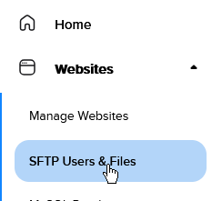
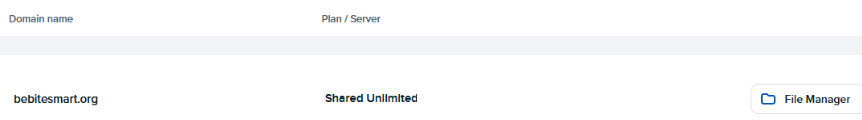
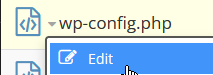
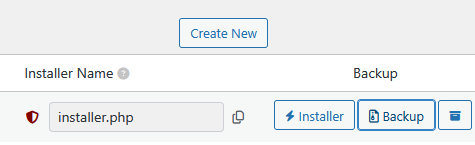

# Be Bite Smart WP Content

[](https://github.com/ghiblimagic/be-bite-smart/actions/workflows/playwright.yml)

> **Scope:** This repo contains non-sensitive theme, plugin, analytic and test logic only.
> Sensitive server configuration files such as `wp-config.php` are not tracked
> here. To edit those, log into DreamHost and use the file manager directly.

### How to use the DreamHost File Manager to Change Sensitive Information

Step 1. Click SFTP Users & Files under Websites



Step 2: Look for the username that has the domain name "bebitesmart.org" attached to i. Click File manager



Step 3: Select the bebitesmart.org folder, then click the sensitive file you need to edit and select edit



## Repository structure

This repo tracks the full `wp-content` directory. Two subdirectories have a
build step required when changing CSS:

- `themes/twentytwentyfive-child` run `pnpm run build` from inside this folder
- `plugins/custom-blocks-for-be-bite-smart` run `pnpm run build` from inside this folder

Each folder has its own `package.json` and `webpack.config.js`, so the build
must be run from inside the relevant folder, running it from the `wp-content`
root won't work.

Playwright tests and GitHub Actions live in `.github/workflows` and `tests/analytics`. These folders contain no CSS and do not require a build step
so changes can be committed and pushed directly.

## Key Locations:

### Custom Blocks Plugin for Be Bite Smart

CSS and logic for all custom blocks.

`plugins/custom-blocks-for-be-bite-smart`

### Child Theme

Site-wide CSS and logic via `functions.php`. We use a child theme so that
updates to the parent Twenty Twenty-Five theme don't wipe our customisations.

`themes/twentytwentyfive-child`

### Custom Plausible Events

Logic for Plausible custom events (kebab-case event names, no custom props).

`themes/twentytwentyfive-child/inc/analytics.php`

#### Event naming

| Pattern | Example |
|--------|---------|
| `{category}-{action}-{language}` | `coloring-books-viewed-english` |
| `{category}-{action}` (no language) | `documentary-watched`, `article-viewed` |

Actions: `viewed` (inline PDF), `downloaded`, `watched` (video), `switched` (site language).

#### Analytics / tracking (hardcoded + PDF overrides)

Most categories are defined in `analytics.php` (no editor setup). **Inline PDF opens** default to `pdf-viewed-english` / `pdf-viewed-spanish`. To track one PDF separately, set **PDF tracking slug (optional)** on that block (e.g. `partnership-pdf`) → View PDF fires `partnership-pdf-viewed-{lang}`, Download fires `partnership-pdf-downloaded-{lang}`.

| Behavior | How it’s determined | Event name(s) |
|----------|---------------------|----------------|
| Episode “Watch Now” / play | Hardcoded | `episodes-watched-english`, `episodes-watched-spanish` |
| Episode video downloads (`educational-video-download` block) | Block class on Education page | `episode-videos-downloaded-english`, … |
| Coloring book inline PDF (`educational-coloring-book-download` block) | View PDF button | `coloring-books-viewed-{lang}` |
| Coloring book PDF file download | `.download-card-pdf-download` in coloring block | `coloring-books-downloaded-{lang}` |
| Other educational PDFs / links (`educational-content-download` block) | Default PDF, or block slug if set | `pdf-viewed-{lang}`, `educational-content-downloaded-{lang}`, or `{slug}-viewed-{lang}` |
| `pdf-toggle` View PDF | Default, or block slug if set | `pdf-viewed-{lang}` or `{slug}-viewed-{lang}` |
| `pdf-toggle` / download-card PDF Download | Default, or block slug if set | `pdf-downloaded-{lang}` or `{slug}-downloaded-{lang}` |
| Mini-documentary | Hardcoded | `documentary-watched` |
| Article links, Read more | Hardcoded | `article-viewed` |
| TranslatePress switcher | Document click delegation (floater renders after footer script) | `language-switched-{lang}` (e.g. `language-switched-spanish`) |

Download-card block types live in `plugins/custom-blocks-for-be-bite-smart/src/shared/download-card/` (shared edit/save). Use **Episode Video Download** for `#download-videos`, **Educational Coloring Book Download** for coloring rows (View PDF + Download per language, like PDF Toggle), **Educational Content Download** for other worksheets/guides.

Optional PDF slugs live in **page content** (block editor), not in git. After deploying, replace old `educational-content-download` rows on Education with the matching new block type in the editor.

**Plausible dashboard:** add goals for `coloring-books-viewed-*`, `coloring-books-downloaded-*`, `pdf-viewed-*`, `episode-videos-downloaded-*`, etc. Retire old `pdf_viewed` / `video_watched` goals.

If the Plausible plugin also logs a generic **file download** goal for PDF clicks, disable automatic file-download tracking in the plugin settings (or ignore that goal) so custom events above are the source of truth.

**Download links:** custom events use `preventDefault` + `plausible(..., { callback })` before starting the file download, so the beacon is not dropped when the browser begins the download (Playwright tests can still pass while production missed events).

### Playwright Tests

Smoke, analytics, video, link, and accessibility tests. They run against production (`https://www.bebitesmart.org` by default) in GitHub Actions. Override the target with `PLAYWRIGHT_BASE_URL` for local or staging runs.

**Install and run** (from `app/public/wp-content`):

```bash
pnpm install --frozen-lockfile   # prefer when lockfile is committed
pnpm exec playwright install chromium   # first time only, local browsers
pnpm test                        # all suites
pnpm exec playwright test tests/a11y/axe.spec.js   # a11y only
pnpm exec playwright test tests/smoke/downloads.spec.js   # download URLs return files
pnpm exec playwright test tests/smoke/security.spec.js   # security hygiene
pnpm exec playwright test tests/smoke/seo.spec.js   # SEO essentials
pnpm exec playwright test tests/smoke/https-host.spec.js   # HTTPS + canonical www host
pnpm exec playwright show-report # open HTML report after a run
```

**HTTPS and canonical host** (`tests/smoke/https-host.spec.js`) — production DNS/host checks (skipped when `PLAYWRIGHT_BASE_URL` is not `https://www.bebitesmart.org`):

| Entry | Expected |
|-------|----------|
| `http://bebitesmart.org`, `http://www.bebitesmart.org`, `https://bebitesmart.org` | Resolve to `https://www.bebitesmart.org` (home + `/learn/`) |
| HTTP entry points | First redirect uses **HTTPS** |
| Canonical origin | Home returns **200** over HTTPS |

**Download URLs** (`tests/smoke/downloads.spec.js`) — auto-scans every critical page for download links:

| Pattern | Selector | Expected type |
|---------|----------|---------------|
| PDF-toggle | `.pdf-toggle-block .download-card-pdf-download` | `application/pdf` |
| Episode videos | `#download-videos .ecd-toggle--download` | `video/mp4` |
| Coloring books | `#download-coloring-books .download-card-pdf-download` | `application/pdf` |

Pages with no matching links are **skipped**. Any link found is verified for **HTTP 200** and the expected `content-type`. New PDF-toggle blocks on any critical page are picked up automatically — no per-page config updates needed.

**SEO essentials** (`tests/smoke/seo.spec.js`) — read-only checks on all critical pages plus crawl files:

| Check | Pass when |
|-------|-----------|
| `<title>` | Non-empty, not a WordPress error page |
| `<link rel="canonical">` | Present and matches `PLAYWRIGHT_BASE_URL` + path |
| `<meta name="description">` | Present, at least 50 characters |
| `/robots.txt` | HTTP **200**, non-empty body (`Sitemap:` line optional — noted in report) |
| XML sitemap | HTTP **200** at `/sitemap.xml` (fallbacks: `/sitemap_index.xml`, `/wp-sitemap.xml`) with valid `urlset` or `sitemapindex` |

**Security hygiene** (`tests/smoke/security.spec.js`) — read-only oops detector:

| Path | Pass when | Why |
|------|-----------|-----|
| `/.env`, `/wp-content/debug.log` | **403 or 404** | Must not be web-readable |
| `/wp-config.php` | **Any non-2xx** (403, 404, **500**, etc.) | Fail only on **2xx** (file served). DreamHost often returns **500** when PHP aborts — acceptable. **403** would require moving `wp-config.php` above the web root; we skip that for this lightweight check. |

**View results:** Terminal shows pass/fail during the run. After any run, `pnpm exec playwright show-report` opens `playwright-report/index.html`. In CI, download the `playwright-report` artifact. The wp-config test includes a **Why 500 is acceptable** attachment.

**A11y — what was checked:** Open a passed a11y test in the HTML report and expand **Attachments**. Each page has:
- `{Page} — what was checked` — plain-text summary: WCAG rule tags, pass/fail threshold, excludes, and every **passed rule id** with its description (e.g. `color-contrast`, `image-alt`)
- `{Page} — scan details (JSON)` — same data structured for tooling

Scope: **WCAG 2.0/2.1 A & AA** plus **best-practice** axe rules; fails on **critical, serious, and moderate**; **minor** listed in attachments but non-blocking; YouTube/Vimeo iframes excluded.

Failures usually mean: (1) the page returned HTTP 500 / WordPress error, (2) a block was removed from the page (e.g. Documentary Video, pdf-toggle), (3) WP Super Cache is serving stale HTML, or (4) for a11y tests, a **critical, serious, or moderate** axe violation on any critical page.

`tests/`

For pnpm install errors (`ERR_PNPM_NO_MATURE_MATCHING_VERSION`), see **Quick Start → pnpm install troubleshooting** — same policy as the plugin and theme builds.

### Github Actions

Workflow configuration for automated CI runs. Currently runs the Playwright analytics tests automatically on each push.

`.github/workflows`

## Quick Start: Setting Up Locally

### Step 1: Log into WordPress

Navigate to `bebitesmart.org/wp-admin` and log in.

### Step 2: Back up the site with Duplicator

In the WordPress dashboard, go to **Duplicator > Packages** and click
**Create New**. Once complete, click **Download Installer** and
**Download Archive** to save both files locally.



**If the download button shows "problem loading web page":**
Log into DreamHost and open the file manager. Navigate to
`bebitesmart.org/wp-content/backups-dup-lite` and download the matching
`.zip` file. You can also download the installer.php.bak file from this folder, but it
will need to be renamed to `installer.php` before use.

You must use the matching installer for that backup, each installer.php is specific to the zip backup.

### Step 3: Set up a local WordPress site with LocalWP

1. Open [LocalWP](https://localwp.com/), click the + button to start a new site.

2. Drag the zip into the "select an existing ZIP or drag your file into the window to import a site' area.

3. Local will automatically detect the package and prompt you to set up a new site.

4. Follow the prompted steps to complete the import

### Step 4: Open the project in VS Code

In LocalWP, right-click your site and select **Open Site Folder** (or the
equivalent option to reveal it in your file manager). Open that folder in
VS Code. any edits made there will be reflected on your local site
immediately.

### Step 5: Install dependencies

Run `pnpm install` in each subdirectory that has a build step (or tests):

```bash
cd themes/twentytwentyfive-child && pnpm install --frozen-lockfile
cd ../../plugins/custom-blocks-for-be-bite-smart && pnpm install --frozen-lockfile
cd .. && pnpm install --frozen-lockfile   # Playwright tests (wp-content root)
```

The `.git` folder is already present since Duplicator included it in the
backup, so there is no need to run `git init` or clone the repo again.

#### pnpm install troubleshooting

**Do not** disable pnpm's release-maturity safety in this repo (no `minimumReleaseAge: "0s"` in any `package.json`, no `.npmrc` with `minimum-release-age=0`). Personal bypasses belong in user config only, if at all.

When install fails with `ERR_PNPM_NO_MATURE_MATCHING_VERSION`:

1. Note the blocked package and version in the error (e.g. old `fsevents` via `@playwright/test`, or a transitive dep of `@wordpress/scripts`).
2. From the failing directory, trace it:
   ```bash
   pnpm why <package-name>
   ```
3. **Fix upstream:** bump the direct dependency; regenerate and commit `pnpm-lock.yaml`.
4. **Lockfile already good:** `pnpm install --frozen-lockfile`
5. **Global pnpm config on your machine:** `pnpm config get minimum-release-age` — adjust user-level settings locally, not in git.

Applies to the Playwright test package, child theme, and custom blocks plugin equally.

### Step 6: Push changes to GitHub and sync the server

#### Setting up SSH access

You will need two SSH keys. one for GitHub and one for DreamHost. Both need
to be set up once before you can push and deploy.

- **GitHub SSH key** follow [GitHub's guide to generating an SSH key and adding it to your account](https://docs.github.com/en/authentication/connecting-to-github-with-ssh)

- **DreamHost SSH key** follow [DreamHost's guide to enabling SSH and adding your key](https://help.dreamhost.com/hc/en-us/articles/216499537)

#### Deploying to the server

Once your SSH key is set up, connect to the server with:

```bash
ssh -i path/to/your-key/.ssh/id_ed##### YourSFTPUsername@bebitesmart.org
```

Replace `path/to/your-key` with the location of your SSH key on your machine
and `id_ed#####` with your actual key filename.
Your SFTP username can be found in DreamHost under **Websites > SFTP Users & Files**.

Then pull the latest changes and clear the cache:

```bash
cd bebitesmart.org/wp-content && git pull origin main && rm -rf cache/supercache/*
```

This pulls the latest commit from `main` and clears WP Super Cache so
visitors immediately see the updated site.

#### wp-config.php and the security test

`wp-config.php` is **not** in this repo. Our security test **does not require 403** for `/wp-config.php` — it fails only on **2xx** (config actually served). DreamHost often returns **500** when something requests that URL directly (PHP aborts before deny rules). That is **acceptable**; forcing **403** would mean moving `wp-config.php` above the web root or custom server config — extra work we skip for this lightweight CI check.

Optional `.htaccess` ideas are noted in `server-snippets/root-htaccess-wp-config.snippet` if you want to experiment; they are not required for CI to pass.

When `WP_DEBUG_LOG` is enabled, WordPress still writes `wp-content/debug.log`; keep debug off in production normally. The security test flags if that file is **web-readable** (HTTP 200). There is no repo `.htaccess` block for the log so you can enable debugging when needed — turn it off and delete the file when finished.

---

## Making Changes to the Child Theme Or Plugin

After editing CSS or any logic that goes through the build process in either
location below, run `pnpm run build` before committing. Otherwise browsers will
serve stale cached stylesheets or logic.

**Child theme** `app/public/wp-content/themes/twentytwentyfive-child`

```bash
cd app/public/wp-content/themes/twentytwentyfive-child
pnpm run build
```

**Custom blocks plugin** `app/public/wp-content/plugins/custom-blocks-for-be-bite-smart`

```bash
cd app/public/wp-content/plugins/custom-blocks-for-be-bite-smart
pnpm run build
```

Then do the normal `git add`, `git commit`, `git push` flow.

### How the cache busting works

Each `src/` entry (e.g. `src/style.js`) imports its CSS file. When `pnpm run build` runs, webpack generates a `build/*.asset.php` file containing a content hash.

`functions.php` reads this hash via `get_asset()` and passes it as the version
parameter to `wp_enqueue_style()`, appending it as a query string
(e.g. `style.css?ver=abc123`).

When the CSS changes and the build reruns, a new hash is generated and browsers fetch the updated file automatically.

**Why not `filemtime()`?** File modification timestamps aren't preserved on git clone or pull, so the version would change unpredictably across environments.

Content hashing is reliable regardless of how files were deployed.

### Troubleshooting

**Logged-in users still seeing old styles after a deploy**

**Problem:** Occasionally a browser session will stubbornly cache a stylesheet despite a new hash being deployed.

**Solution** Hard refresh
with `Ctrl+Shift+R` / `Cmd+Shift+R` to force a fresh fetch.

**Why this happens** This is a browser quirk, not a build or server issue.

**How to diagnose if its a browser quirk or a bug:** Open the page in an incognito window (logged out).

- **Correct styles do NOT appear in incognito** You likely forgot to run
  `pnpm run build` before pushing. Confirm by checking the relevant
  `build/*.asset.php` file on GitHub or on the DreamHost server to see if the file updated.

- **Correct styles DO appear in incognito but not in your logged-in session**

  The build and server are fine. WordPress doesn't cache pages for logged-in
  users, so they should always receive a fresh page with the updated stylesheet URL.

  Occasionally a browser will still serve the old stylesheet from its own
  cache despite the URL changing. This is the browser misbehaving, not a
  build or server issue. A hard refresh (`Ctrl+Shift+R` / `Cmd+Shift+R`) forces the browser to bypass its cache and fetch the latest version.

## Child Theme `functions.php` Overview

A quick reference for what each section of `functions.php` handles, so you
know where to look when making changes.

| Section                                   | What it does                                                                                                                                                                            |
| ----------------------------------------- | --------------------------------------------------------------------------------------------------------------------------------------------------------------------------------------- |
| `get_asset()`                             | Reads the content hash from `build/*.asset.php` for cache busting. Falls back to version `1.0.0` if the file is missing so the site stays up                                            |
| `twentytwentyfive_child_enqueue_styles()` | Loads the parent theme CSS, then the child theme stylesheets with their content hashes as version strings. The Forminator stylesheet is only loaded on the contact page                 |
| Hero image preload                        | On the front page only, preloads the hero background image at the correct breakpoint size to improve LCP                                                                                |
| Font preload                              | Preloads the three above-the-fold fonts (Urbanist 400, Urbanist 600, Omnes 500) on the front page only                                                                                  |
| UTM + QR param preservation               | Prevents WordPress's canonical redirects from stripping UTM params and the `?qr` flag used to detect QR code visitors                                                                   |
| Font display                              | Sets `font-display: optional` to prevent layout shift when fonts load slowly                                                                                                            |
| Shared block styles                       | Loads `shared-block-styles.css` via `enqueue_block_assets` so styles apply in both the editor and the front end                                                                         |
| jQuery defer                              | Defers jQuery on the front page for logged-out visitors to improve load speed. Logged-in users and the contact page are excluded                                                        |
| Autosave cleanup                          | Deletes autosave revisions on post save to keep the database tidy                                                                                                                       |
| Submenu hover logic                       | Handles desktop submenu open/close via CSS hover, with JS only handling click-to-close and `aria-expanded` syncing. Bypasses WP's Interactivity API using capture phase event listeners |
| Show more button                          | Toggles hidden content sections on the front page with an `is-visible` class                                                                                                            |
| LCP lazy load fix                         | Forces `loading="lazy"` and `fetchpriority="low"` on images marked with `no-lcp` that WordPress would otherwise eagerly load                                                            |
| Scroll to top accessibility               | Sends keyboard focus to `<main>` when the scroll-to-top button is clicked, using capture phase to beat jQuery's `stopPropagation`                                                       |
| Discord embed                             | Strips author name and URL from oEmbed responses to avoid exposing account information in Discord link previews                                                                         |
| QR experience template                    | Swaps in a header/footer-free template for pages using the `custom/qr-experience` block                                                                                                 |

## Child Theme Webpack entries

The child theme has four build entries, each generating its own
`build/*.asset.php` hash for cache busting:

| Entry           | Purpose                                                                                              |
| --------------- | ---------------------------------------------------------------------------------------------------- |
| `style`         | Main child theme stylesheet (`style.css`)                                                            |
| `navbar`        | Navbar styles (`css/navbar.css`)                                                                     |
| `forminator`    | Contact form styles, only loaded on the contact page (`css/forminator.css`)                          |
| `shared-blocks` | Styles shared across blocks, loaded in both the editor and front end (`css/shared-block-styles.css`) |

## Custom Blocks Plugin `custom-blocks-for-be-bite-smart.php` Overview

### Dynamic blocks (PHP rendered)

These blocks use a `render_callback` instead of a static `save()` function,
meaning PHP generates the HTML on each page load rather than storing it in
the database.

| Block         | Why dynamic                                                                                                                                 |
| ------------- | ------------------------------------------------------------------------------------------------------------------------------------------- |
| Bio Card      | Uses `wp_get_attachment_image()` to generate correct `srcset`/`sizes` for photos. Template changes update all bio cards site-wide instantly |
| Hero          | WordPress's content sanitizer was mangling `<picture>` and `<source>` tags on static save, so PHP renders them instead                      |
| QR Experience | Swaps in a header/footer-free template for QR code landing pages                                                                            |
| Video Quote   | Appears on high-traffic pages — dynamic rendering allows `srcset` to serve correctly sized thumbnails per device                            |

### Static blocks

These blocks use a standard static `save()` function:
Research Article, Episode Card, Article or Commentary, PDF Toggle,
Unfunded Episode, Educational Content Download, Sponsorship Contact,
News and Coverage, Press Release.

### Shared scripts (manual enqueues)

These JS files are shared across multiple blocks so they can't be owned by
a single block's `viewScript` — they're enqueued manually and only on the
pages that need them:

| Script                                   | Loaded on                             |
| ---------------------------------------- | ------------------------------------- |
| `video-toggle.js`                        | Front page, Education                 |
| `read-more.js`                           | News & Media, Legal                   |
| `toggle-system.js` + `pdf-toggle` styles | Education, News & Media, Partnerships |

### Other

- **Application Passwords** — disabled site-wide for security
- **`wp_kses` allowlist** — adds `<picture>`, `<source>`, and `<iframe>` to
  WordPress's allowed HTML in post content, since WordPress strips these by default

---

## Webpack entry points

Each block compiles its own `index.js` (editor + frontend logic). A few blocks
or shared scripts have additional entries:

| Entry                    | Purpose                                                                  |
| ------------------------ | ------------------------------------------------------------------------ |
| `bio-card/bio-toggle`    | Read more toggle logic specific to bio cards                             |
| `qr-experience/frontend` | Frontend-only JS for the QR experience block, separate from editor logic |
| `read-more`              | Shared read more logic for news and legal pages                          |
| `toggle-system`          | Shared toggle logic used across PDF toggles and related blocks           |
| `video-toggle`           | Shared video toggle logic for front page and education page              |
